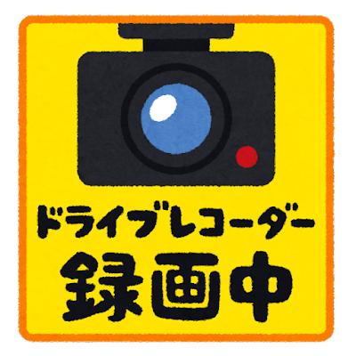

  

## ドラレコで身を守る

　あおり運転の危険性が叫ばれて久しい。2020年の道交法改正で妨害運転罪が創設されたものの、いまだにあおり運転の被害が報道される。報道されるだけで増えてないのかもしれないが、実際に車間距離保持義務違反で[年間1万5千件程度は検挙されている](https://response.jp/article/2021/10/29/350853.html)という。

　小型のバイクでは自動車以上に煽られやすいことが予想される。特にスーパーカブ90や現行の110の場合は原付二種（〜125cc）を表す後部の白い△マークとフロントフェンダーの白縁取りが付いていても原付一種（〜50cc,いわゆる原付）と間違えられやすいし、法定速度が60km/hであるといってもパワー不足から幹線国道では遅い存在だ。そんな弱者が身を守るには？

　あおり運転にはドラレコ。これは[国家権力も言ってる](https://www.npa.go.jp/bureau/traffic/anzen/aori.html)。じゃあ、付けちゃおう。

## ドラレコの選び方

　たとえば Amazon でバイク用のドライブレコーダーを探すと安いものから高いものまで色々な種類があり、選ぶのが難しい。ここでは自分の基準をいくつか挙げる。おおまかに、高い優先順位が上にある。

- 前後カメラ
- 30fps・25fps **ではない**
- 常時録画・ループ録画
- ヘルメットマウントではない
- 本体が小型で防水仕様
- モニター不要・スマートフォン対応があったら嬉しい
- できれば6時間ぐらいは録画したい

### 前後カメラ

　あおり運転は後ろからも前からもやって来る。前だけではなく後もほしい。

### 30fps・25fps **ではない**

　電源周波数は西日本で60Hz・東日本で50Hzなので、LED信号機はそれぞれ120回/秒・100回/秒点滅してる。カメラのフレームレートが30fps・25fpsだと信号の「滅」のタイミングに同期して何色を示しているのかわからなくなることがある。なお安い製品はもっとも一般的な30fpsを採用しているものが多い印象。

参考リンク: [ドライブレコーダーのLED信号対策のまとめ（ドライブレコーダーの専門サイト LaBoon!!）](https://car-accessory-news.com/drive-recorder-led/)

### 常時録画・ループ録画

　せっかく付けてもスイッチを付け忘れてました……となったら悲しいだけ。またメモリーカードの容量が足りなくなっても古いものから上書きしてくれるループ録画は必須。Gセンサーによって録画が開始される機種もあるが、対あおり運転という観点からは微妙。手動スイッチがあれば良いかも？

### ヘルメットマウントではない

　ヘルメットマウントは本体への配線が不要な分設置（装着？）が簡単だし、手軽に見える。しかしツーリング等でヘルメットを脱いだ際に盗まれる危険性も増すので避けた。

### 本体が小型で防水仕様

　カブのサイドカバー内に設置することを考えていたので、小さい方がありがたい。また雨は多少侵入すると思うので防水であることに越したことはない。

### モニター不要・スマートフォン対応があったら嬉しい

　設置する箇所の都合上頻繁にモニターを観ることはないし、スマートフォンアプリに対応していたらその場で観れるから良い。

### できれば6時間ぐらいは録画したい

　事故・あおり運転対策ではないが、ツーリングの記録として。これぐらいの時間分録画できれば1日の走行の大半は録画できそうだから。欲をいうと12時間ぐらいできたら良いのだけど、そんなに長い時間を乗る日は年間に数日もないし、大事な動画は休憩中に保護・保存しておけば良い。

## 購入したもの

[デイトナ Mio(ミオ) バイク用 ドライブレコーダー 前後2カメラ 200万画素 フルHD 防水 防塵 LED信号 Gセンサー GPS MiVue M760D 17100](https://amzn.to/3HDvAy0)

　上に挙げた条件は全て満たしている上に、Windows/Mac/iOS/Android に対応したアプリがそれぞれある。録画時間は microSD を128GBに交換したら6時間程度撮れるらしいので、一緒に購入した。

　もちろんギボシや電工ペンチ等も無いと困るのだが、それは次回の設置編（予定）で。
