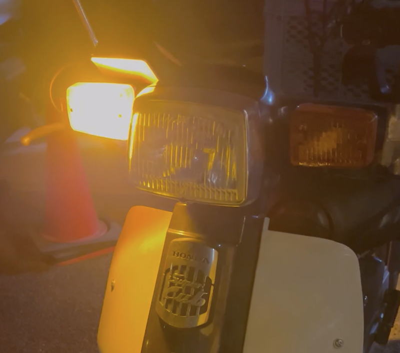
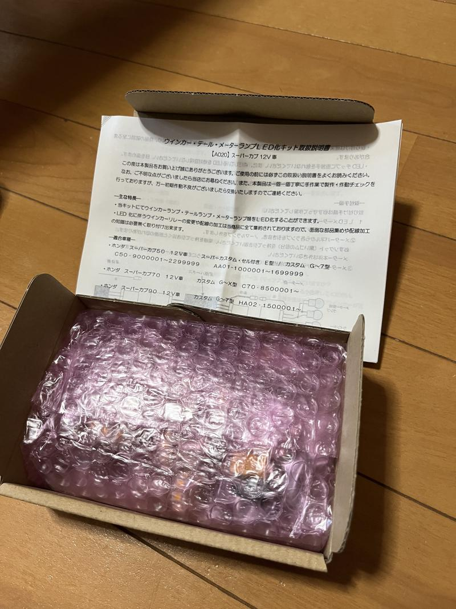
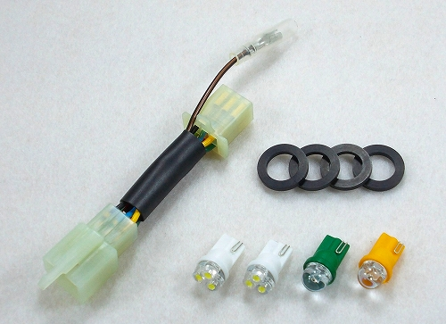
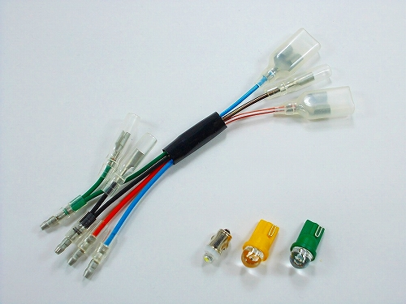
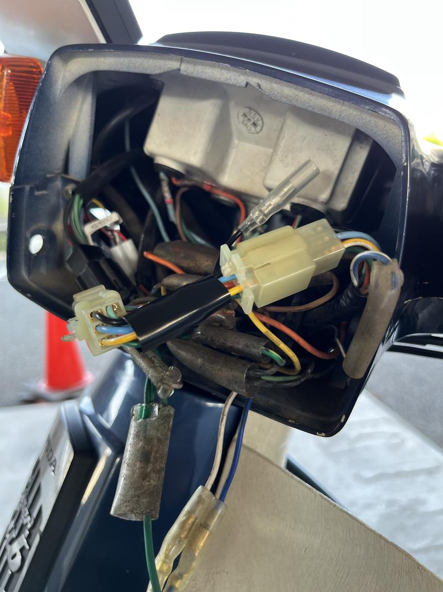
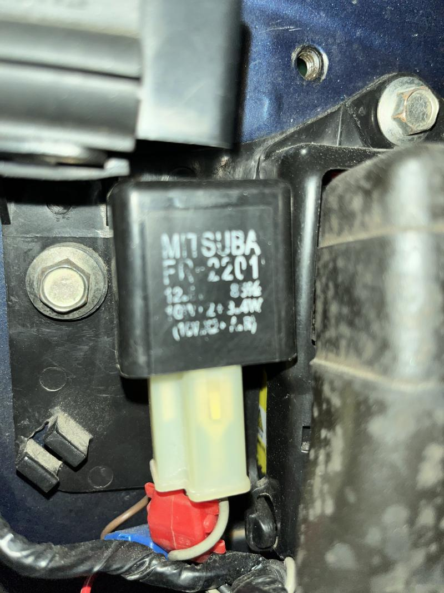
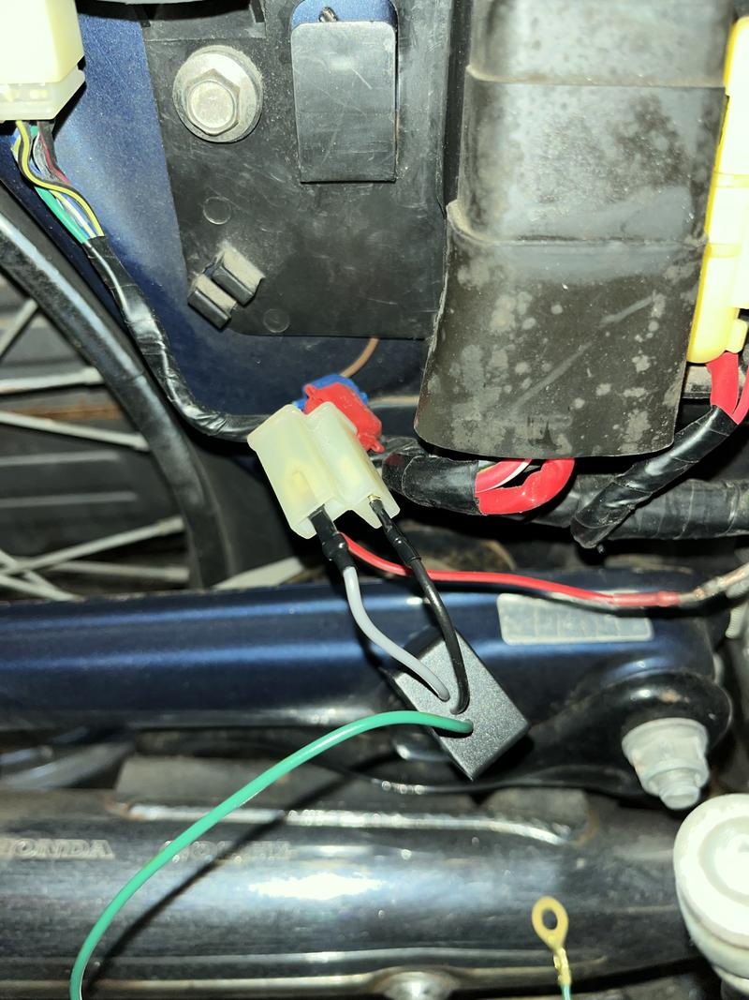
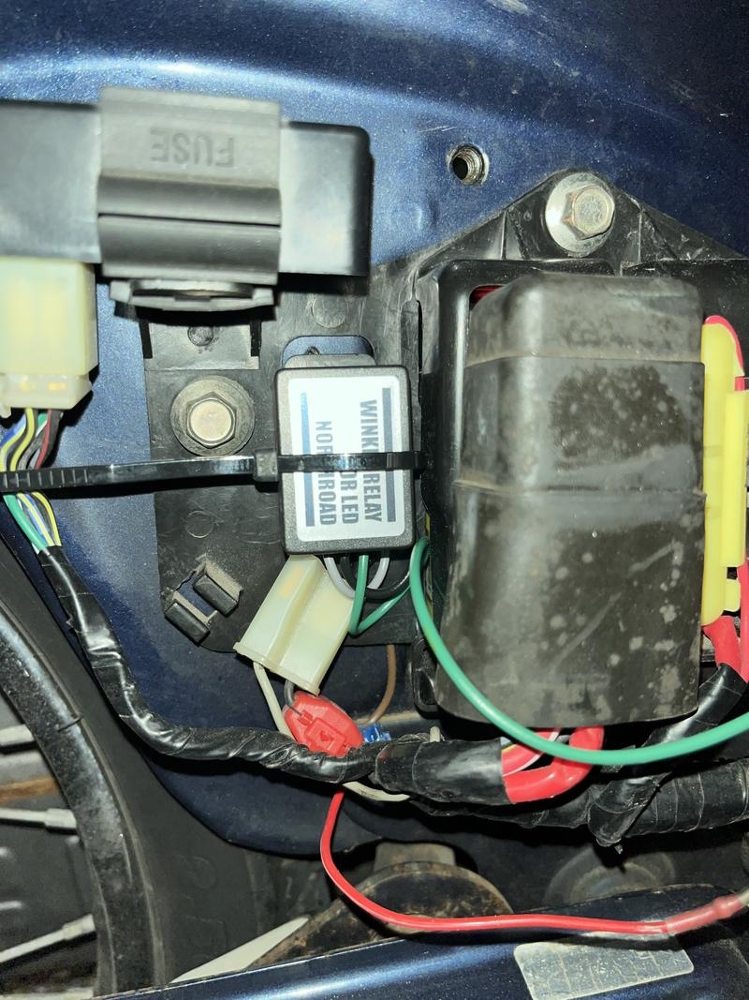
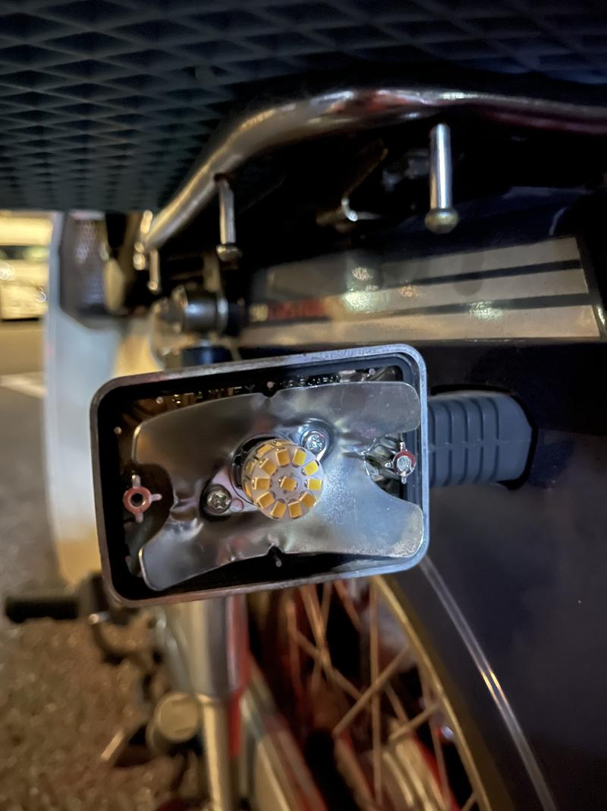

  

## ヘッドライト以外も！

　先日の記事ではヘッドライトを LED 化して21世紀に突入したが、本当はウインカーやブレーキランプも LED にしたい。ヘッドライト同様にこれらは安全用の部品なので、より明るく・球切れリスクの少ない LED 化のメリットは大きい。

　ただしウインカーの場合はウインカーリレーを変える必要があるので素直にキットを使うのが楽で確実だ。今回は[ノースロードのウインカー・テール・メーターランプ LED 化キット](https://northroad.jp/item_a/)を使った。メーター灯を LED 化するつもりはなかったが、あるというなら使おうじゃないか。カブのニュートラルインジケータは晴れた日にはとても見にくいし。購入は[アウトスタンディング](https://www.out-standing.com/shopbrand/ct454/)でも可能。在庫次第ではこちらの方が早そうではある。

## 購入時の注意

　車体番号から適合するキットを選んでも、デラックス系とカスタムを間違えると適合しない。

## メーター灯・インジケータの作業

　基本的にはヘッドライトのレンズ部をプラスドライバーで外してハースを割り込ませて、球を付け替えるだけ。カスタム（角目）の場合はカプラになっているので本当にポン付け。

デラックス（丸目）はギボシを何個か抜き差しする必要があるようだが、それでも「ポン付け」の範疇だろう。

（画像2点は [ノースロード Web サイト](https://northroad.jp/a111/)より）

　　実際のヘッドライトケース内部はとても狭いので球を取るのも結構コツがいる。古いと固着しているのかも。またケーブル類をギチギチに収めないといけない。こんな感じ。

ギチギチ感は伝わらなかった。

## ウインカーリレーの交換

　もともと付いてるリレーを引き抜いて、黒色と灰色の線を間違えないように挿して、アースして、結束バンドで止めるだけ。

これを抜く（ピンボケ）

挿す

留める。

## ウインカー・テールランプの交換

　プラスドライバーでレンズを外し、球を外して付けるだけ。解説のしようもないぐらい簡単。

## 成果

　動画だと一目瞭然……と思ったけど、メーターランプの使用前動画を撮ってなかった。





## 所感

　キットを使ったので特筆すべき点はないが、便利だし安全になるし簡単なので、万人におすすめできると思う。
