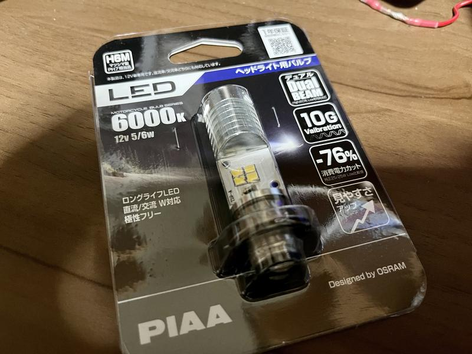
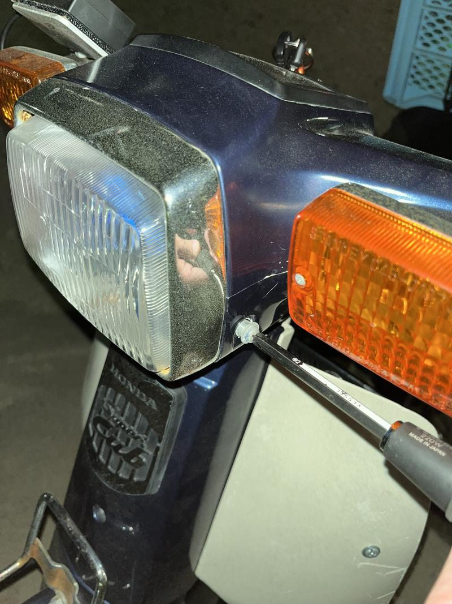
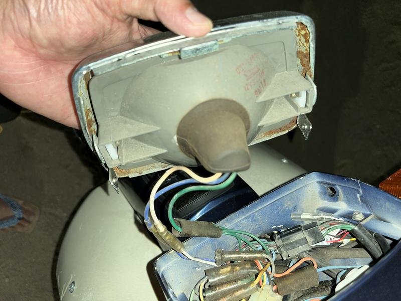
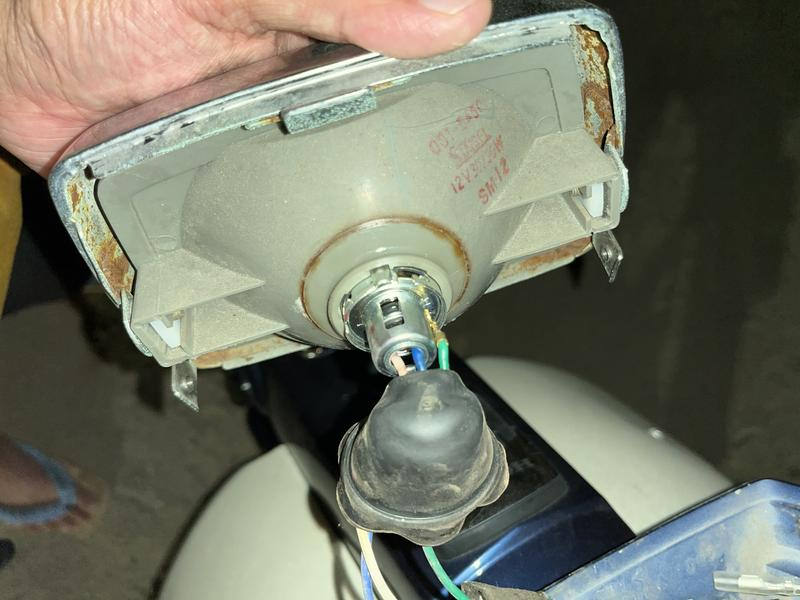
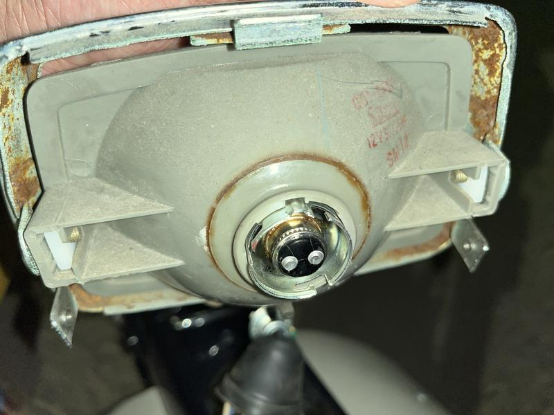
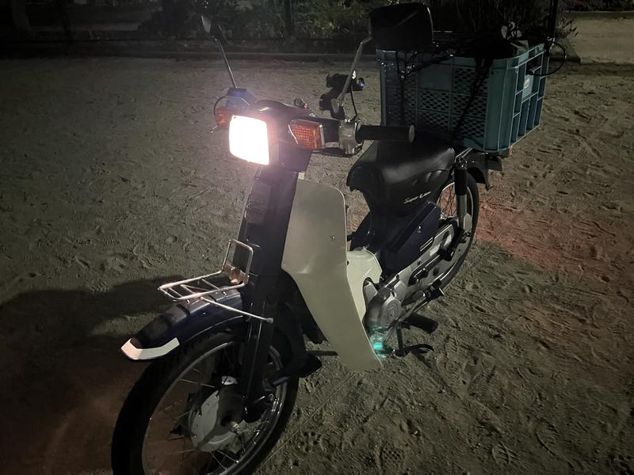
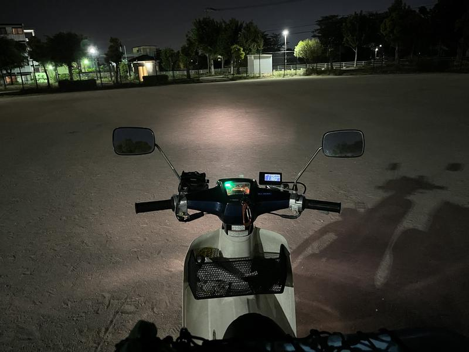
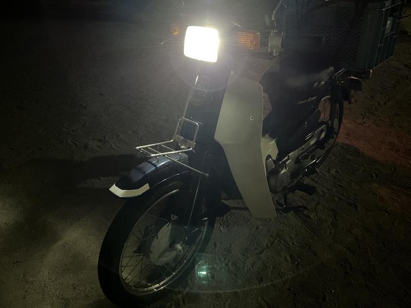
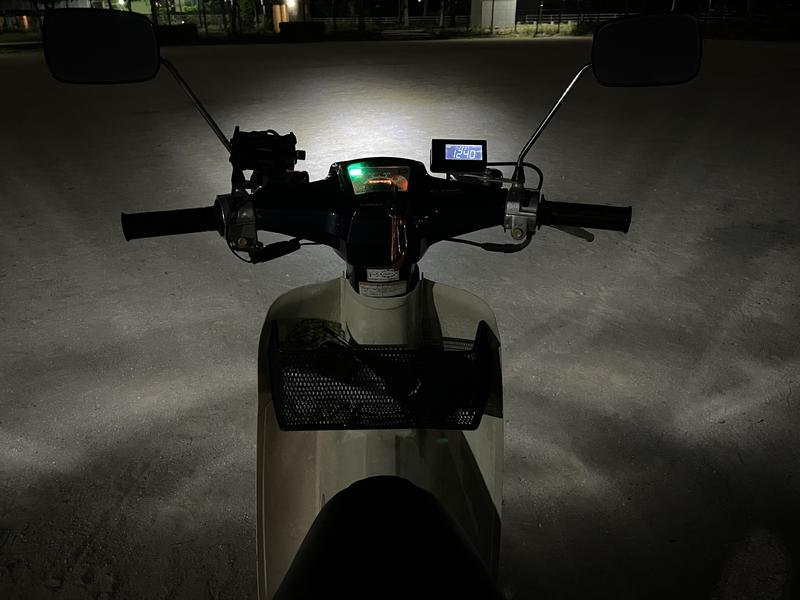
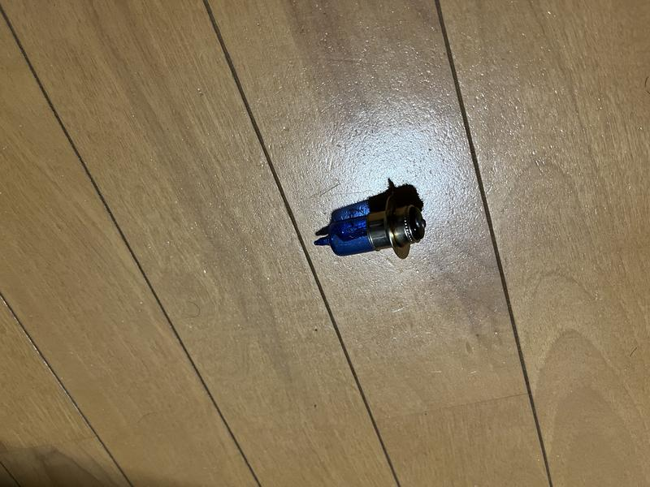

## 動機

　ミニバイクのヘッドライトは暗い。先日シン・ウルトラマンを観るために郊外のイオンシネマまで深夜に行ったのだけど、怖い。夜中は荒い運転の車もいるので自衛のためにも明るくしたくなった。また LED は球切れのリスクを軽減できるのでツーリングでも嬉しいはず。

## 使用したバルブ

[https://amzn.to/3MtKiJt](https://amzn.to/3MtKiJt)

　カブカスタムは角目なので丸目カブの使用例があてにならない。だからなるべく小型のものを選択した。ファンレス VS ファン付きの戦争には加担しないけど、可動部が少ないほうが良いような気がしたのでファンレスに。安いので万一切れても元ついてたバルブを持っとけば良いだろう。あれ？球切れリスクの話は……

## 作業

　ヘッドライトケースの左右のプラスネジを緩めて開ける。

 

　開けたらコネクタの部分にカバーが付いているので取る。

 

　コネクタは押しながら反時計回りに回せば取れる。コネクタのバネでバルブを押さえつけているので、コネクタを取ればバルブも抜ける。

　あとはバルブを入れ替えて、逆の工程を行えば良い。

## 使用前 使用後

使用前

 

 

使用後

 

 

おまけ: ついていたもの（マツシマのハロゲン）

## 21世紀だ！

　明るくなって、消費電力も下がり、寿命も長くなって21世紀が来た。なお2005年式なのでもともと十分21世紀。
