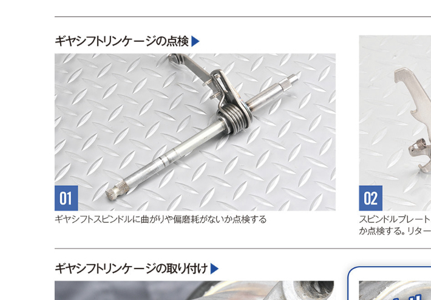
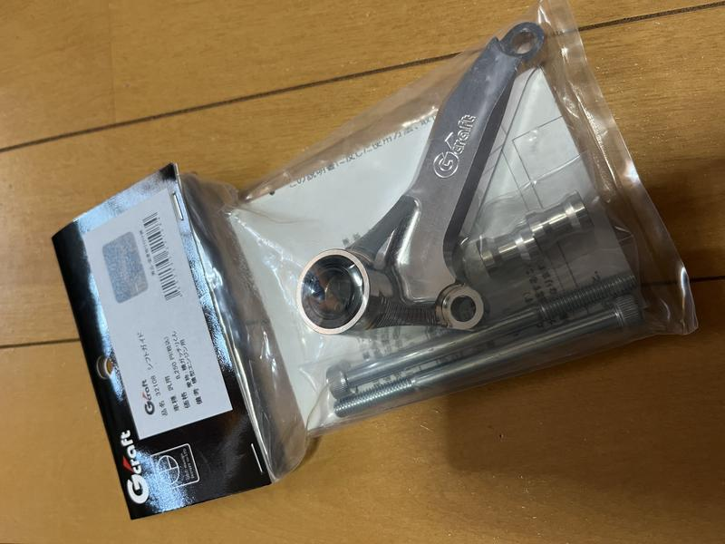
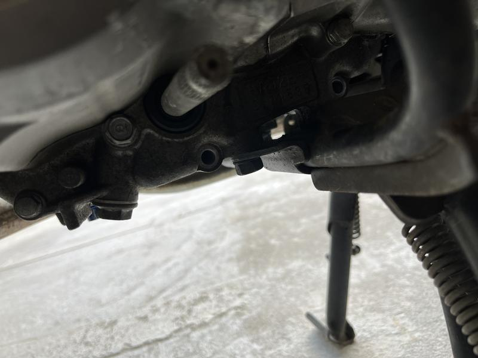
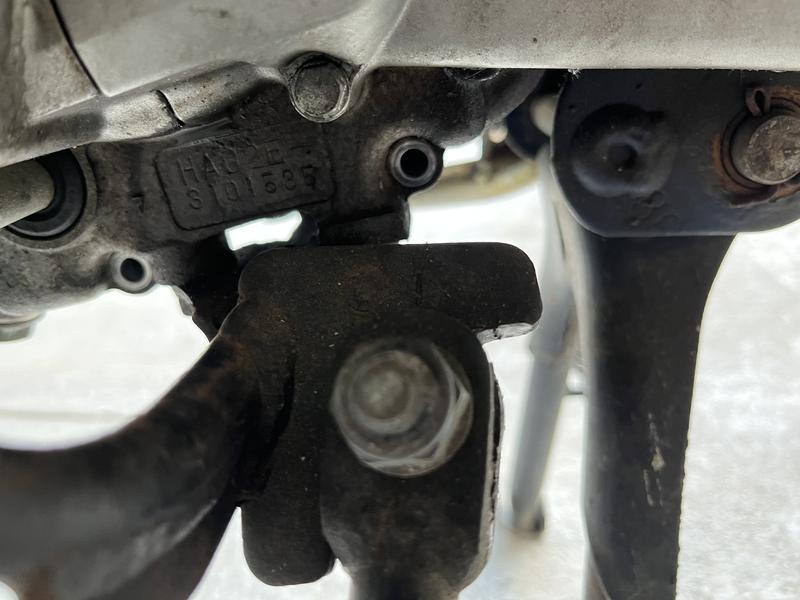
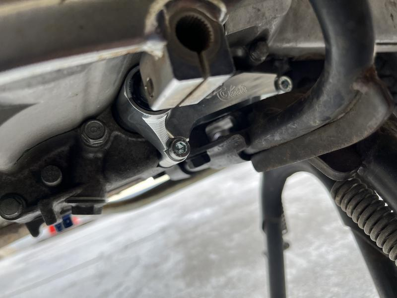

  
## より良いシフトフィールを求めて

　[前回](https://tbsmcd.net/post/cub-shift-pedal/)シフトペダルにカヌレ状のものを付けることで、かかとでのシフトダウンを簡単にしたのだが、そもそもカブのシフトチェンジはガチャガチャいって素直に入らないこともある。その理由として挙げられるものに「ギヤシフトスピンドルの長さ」がある。

[HONDAスーパーカブパーフェクトメンテ エンジン編](https://amzn.to/3lRH9ra) より

　この棒の左端についたチェンジレバーを足で踏んで右寄りについたリンケージを操作するわけだから、歪み・たわみ・しなり等が発生するのは確かだろう。それを解消するのがシフトガイドだ。

## 使ったパーツ

[Gクラフト (Gcraft) シフトガイド(横ガッチリくん) 32108](https://amzn.to/39Xt9tm)

　製品の説明には純正ステップとは併用できないとあるが、問題なく付いた。モンキーのことだと思われる。グリスアップする必要があるので、グリスもしくは耐水性のチェーンルブなども。

## 取付作業

　

　8mmのボルトを2個はずす必要がある。ディープのラチェットレンチを使ったら良いと思う。おれは[これ](https://amzn.to/3MT2mNy)を使っている。

　取り付けは付属のネジで。アーレンキーがあったら嬉しい。

## 所感

　もともとのシフトフィールはガチャガチャ10に対してスコッと入るのが1から3ぐらいの割合だったのが、ほぼ100％軽くスコッと入るようになった。かかとでクラッチを切るのも楽かつ正確にできるようになった。切る感覚がわかりやすいというか。工数は15分というところなので気軽さも良い。
