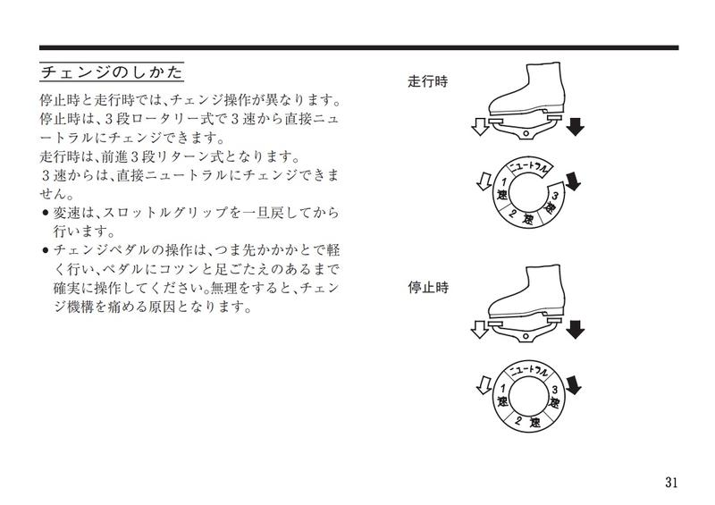
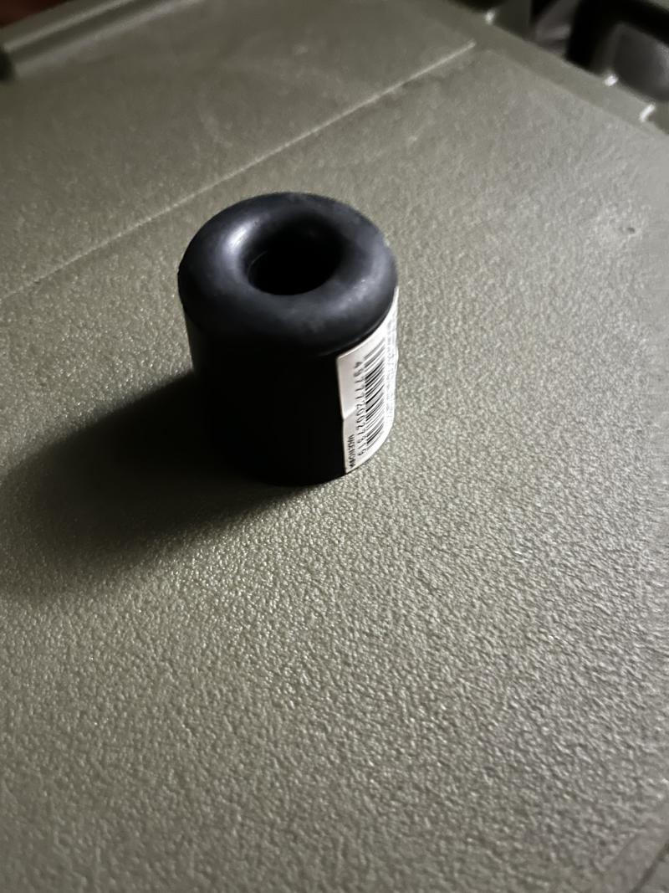
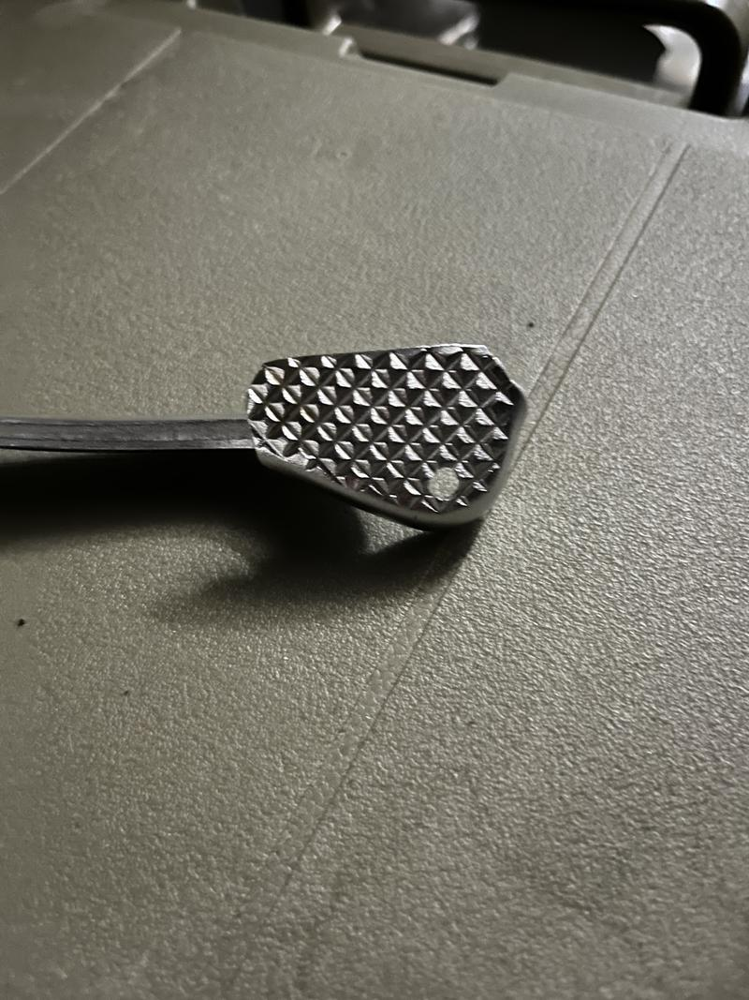
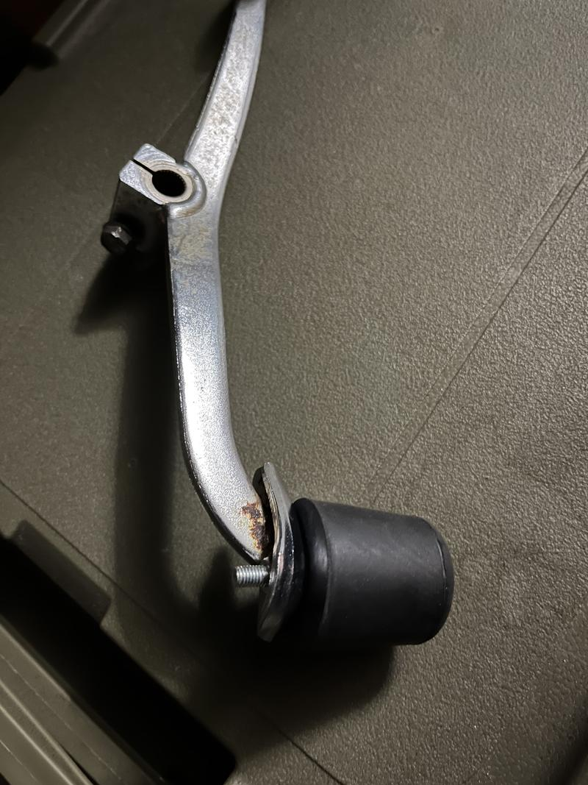
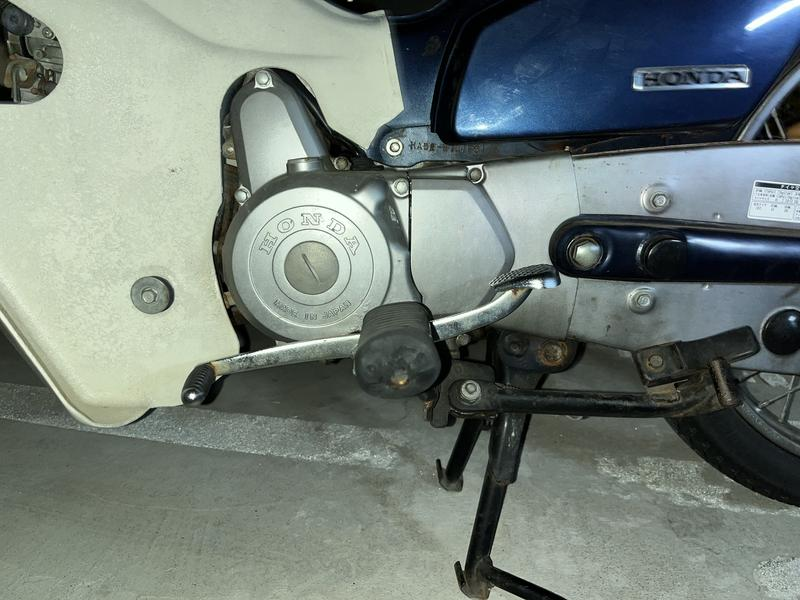
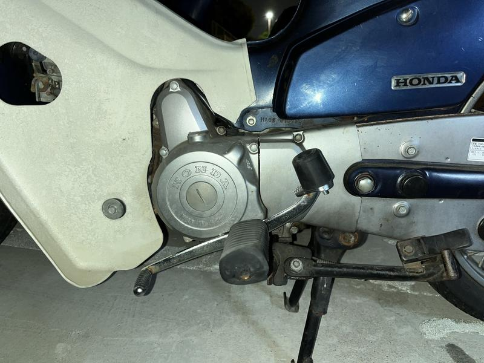
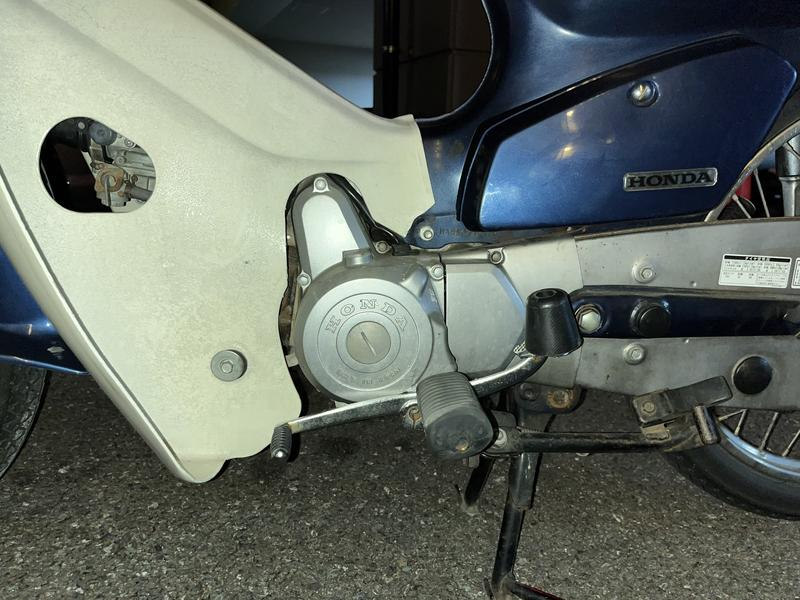

## かかとで踏むのは厳しい

　スーパーカブのシフトペダルはシーソー式となっており、つま先側を踏むとシフトアップ、かかと側を踏むとシフトダウンする。

　[取扱説明書](https://www.honda.co.jp/ownersmanual/pdf/motor/supercub90/30GFN600_web.pdf)（画像参照元）にもある通りかかとで踏むことを想定されているようだが、実際にやってみると角度が結構キツくておれは普段つま先で踏んでいる。しかしシフトダウン時に脚を移動させるのは操作がもたついて不満があった。またつま先で跳ね上げてシフトダウンするのはクラッチ操作も兼ねているのでちょっと重い。それではと、かかと側に合わせてシフトペダルの角度を変えてみても今度はつま先側がキツい。

　これはよく足首の硬さなどといわれる。しかし[スーパーカブC100が発売された1958年当時の成人男性の平均身長が160cm台前半](http://www.natubunko.net/rekishi05.html)で自分の現在の身長が身長が178cmあることを考えれば、そもそも無理なことかもしれない。脚が長くなれば膝が前に出るからだ。そこでシフトペダルの方を自分に合わせることにする。

## かかと側を底上げする

　金属、もしくは硬めのゴムで底上げしたらかかとで無理なく踏めそうだったので、モノタロウなどを見ていると戸当り（ドアを全開にしたときに壁に当たらないようにする部品）が良さそうだった。そして昼間にホームセンターに行って適当なものを買ってくる。

天然ゴム製なので耐熱安全温度は60℃程度。真夏の路面が65℃ぐらいまで上がるらしいので、少し高さがあると考えれば許容範囲だろう。100円以下で買えた。

## ドリルで穴あけ

　同時にホームセンターでステンレス・アルミに使えるドリル歯を購入する。これは数百円で買える。手持ちのマキタの電動ドリルですんなり穴が開いた。もともと付いていたペダルがつま先で跳ね上げてシフトダウンできる社外品だったので躊躇なく。

あとは戸当りをボルト・ナット・ワッシャーで固定する。

## 装着

使用前

 

使用後。かかと側の操作性を優先したらつま先側が下がりすぎたので一回り大きいものに取り替える。

　レッグシールドが折れているのは気にしないで……

　駐車場で試乗したところ思った通りの操作感で満足している。ゴムなので劣化することも考えられるが前述の通りつま先でシフトダウンも可能なので深刻な事態にはならないだろう。重いけど。

## 今後について

　現状で不満が一つ解消された。しかし耐久性などの観点からアルミ製の何かに変更することはあるだろう。トライ・アンド・エラーもミニバイクの醍醐味だと思っている。
