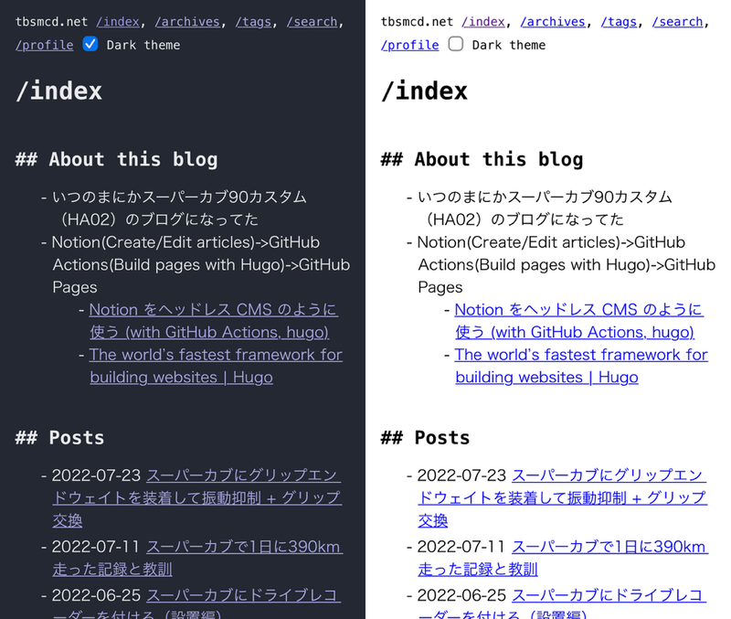
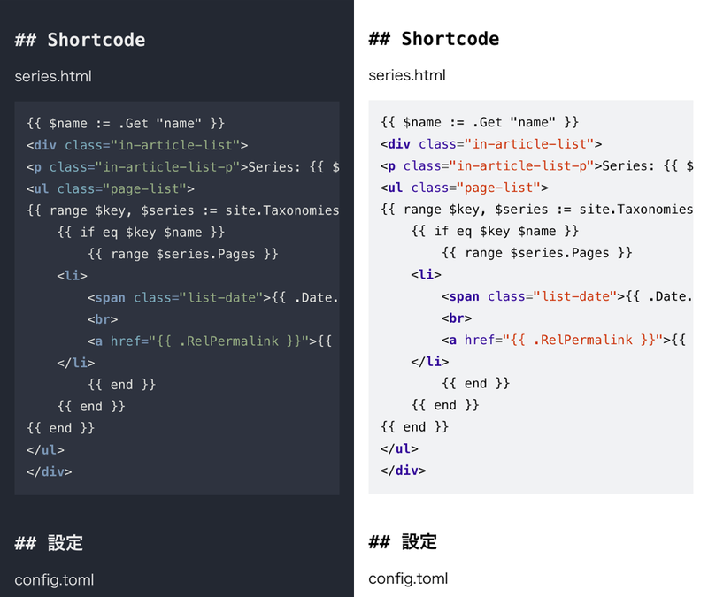

  
 

## 用語の整理

　ダークモード、ダークテーマ……英語だと black mode, dark mode, dark theme, night mode など様々な呼び方があるようだ（[Light-on-dark color scheme - Wikipedia](https://en.wikipedia.org/wiki/Light-on-dark_color_scheme)）。ここでは

- ダークモード: 暗い背景に明るい文字を表示する **OS の設定**
- ダークカラースキーム: 暗い背景に明るい文字を表示する色彩設計

としたい。

## 成果物

 

 

## なぜダークモードに対応したのか？

　この blog を自分で見て眩しいと感じるから。

　ふだん自分が使っているデバイスはすべてダークモードに設定しているし、ターミナルや IDE もダークカラースキームで表示している。そんな中たまに真っ白な背景を見ると眩しい。この blog ももちろん同様に眩しい。補助的な理由としては簡単にできそうだから。ダークモード対応と大袈裟に言ってみても、 Web サイトである以上はダークカラースキーム自体は CSS で作れば良いだけだし、 OS のダークモード設定（or not）もおそらく JavaScript で取得できるのだろう（例えば Google 検索は OS のモード設定に従ってるし）……という軽い気持ち。やっておくと自分にとっても多少の知見にはなるだろうし。

## どういうときにダークカラースキームを使いたいのか？

　前述したように自分自身にとっての問題が「ふだん暗い画面を見ていて、急に明るい画面をみたら眩しい」なので、 OS の設定がダークモードである場合には blog もダークカラースキームで表示したい。ただ人それぞれ好みや事情があるので選択の余地はあったほうが良さそうだ。OS はライトモードだけどこの blog は眩しく感じる人もいるだろう。

- 当 blog においてカラースキームを明示的に選択しない場合は OS のモードに従う
- 明示的にカラースキームを選択した場合はそれに従う

以上をベースに考える

## 何が必要か？

これを実現するためには

- JavaScript
	- OS のモード設定を取得できる
	- Checkbox 等の UI でカラースキームを選択できる
	- 選択したカラースキームを localStorage 等で保存できる
	- 保存したカラースキームで表示できる
- CSS
	- ダークカラースキームを表示できる
	- デフォルトのカラースキーム（従来のもの）を表示できる
	- hugo でシンタックスハイライト用に使われているテーマと共存できる

これらが必要になる。

 

続く。
