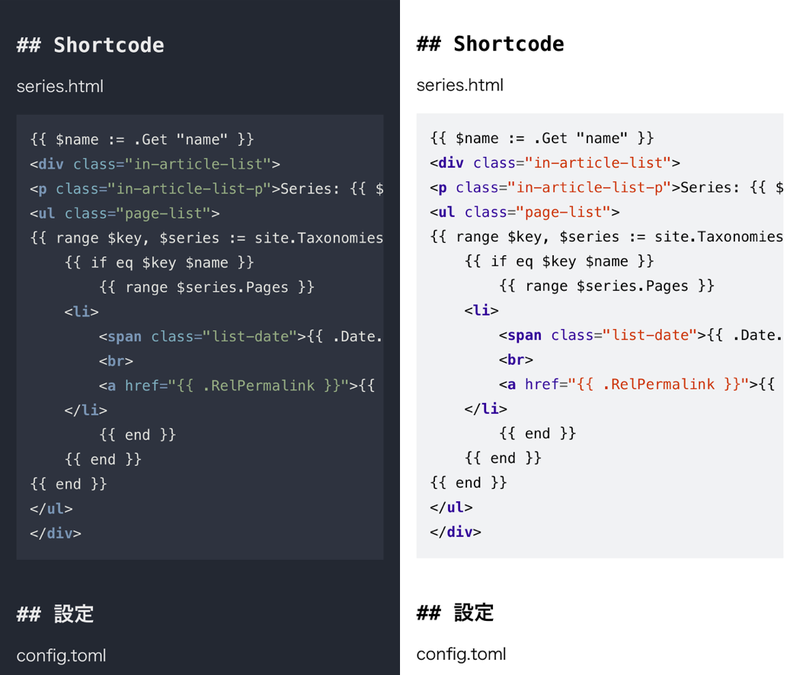

  
 

## 用語の整理

　ダークモード、ダークテーマ……英語だと black mode, dark mode, dark theme, night mode など様々な呼び方があるようだ（Light-on-dark color scheme - Wikipedia）

## 成果物

 

 

## なぜダークモードに対応したのか？

　この blog を自分で見て眩しいと感じるから。ふだん自分が使っているデバイスはすべてダークモード（ダークテーマ）に設定しているし、ターミナルや IDE も黒基調のテーマを使っている。そんな中たまに真っ白な背景を見ると眩しく感じる。この blog も同様なので設定できるならしてしまいたかった。補助的な理由としては簡単にできそうだからというのもある。ダークモードと大袈裟に言ってみても、 Web サイトである以上は CSS でテーマを作れば良いだけだし、 OS の設定もおそらく JavaScript で取得できるのだろう（例えば Google 検索は OS のモード設定に従ってるし）……という軽い気持ち。やっておくと自分にとっても多少の知見にはなるだろうし。

## どういうときにダークモードを使いたいのか？

　前述したように自分自身にとっての問題が「ふだん暗い画面を見ていて、急に明るい画面をみたら眩しい」なので、 OS の設定がダークモードである場合には blog もダークモードで表示したい。一方で、人それぞれ好みや事情があるので選択の余地はあったほうが良い。OS はライトモードだけどこの blog は眩しく感じる人もいるだろう。

- 当 blog においてテーマを明示的に選択しない場合は OS のモードに従う
- 明示的にテーマを選択した場合はそれに従う

以上をベースに考える

## 何が必要か？

これを実現するためには

- JavaScript
	- OS のモード設定を取得できる
	- Checkbox 等の UI でテーマを選択できる
	- 選択したテーマを localStorage 等で保存できる
	- 保存したテーマで表示できる
- CSS
	- ダークテーマを表示できる
	- デフォルトのテーマ（従来のもの）を表示できる
	- hugo でシンタックスハイライト用に使われているテーマと共存できる

これらが必要になる。

 

続く。
