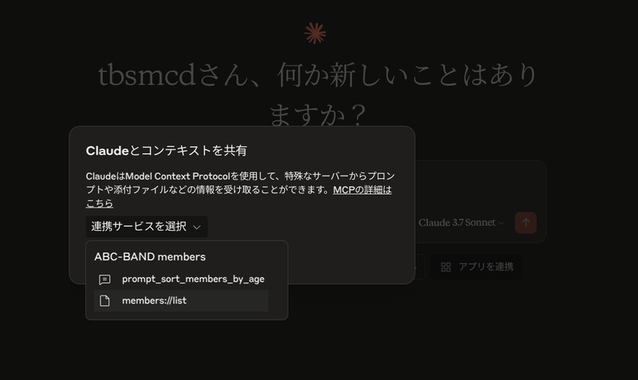
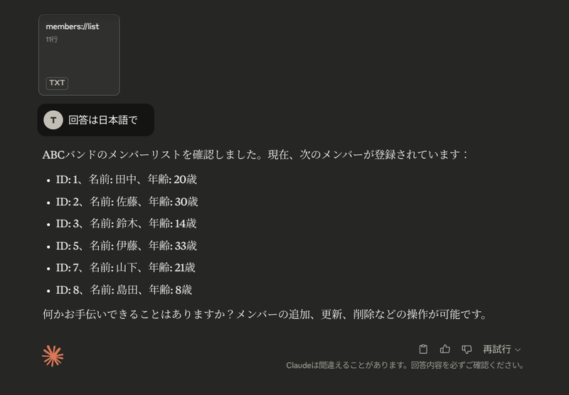
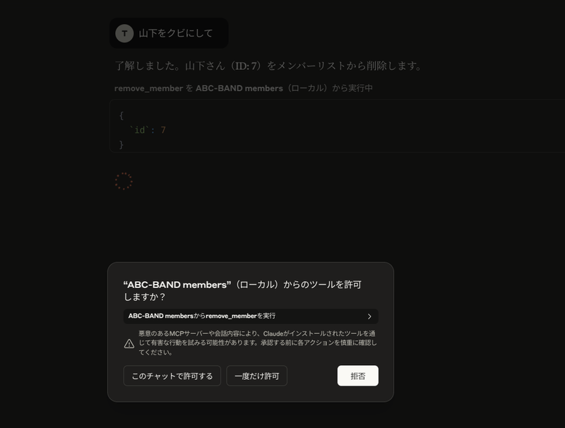
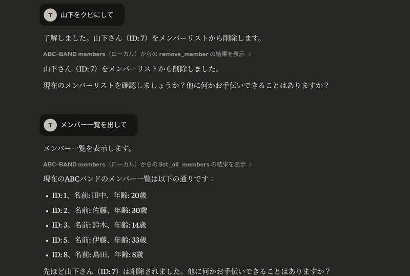
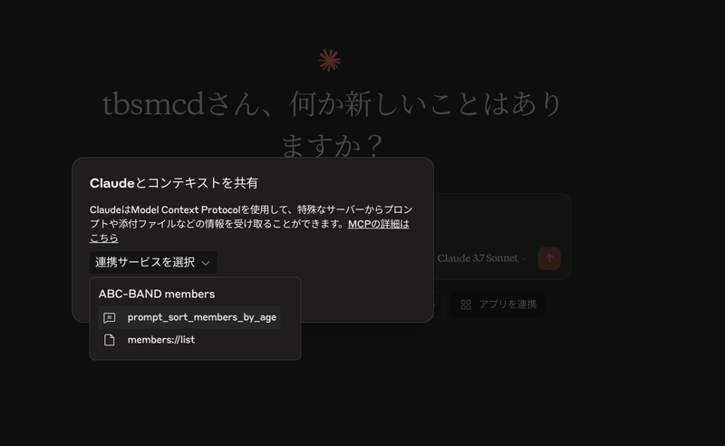
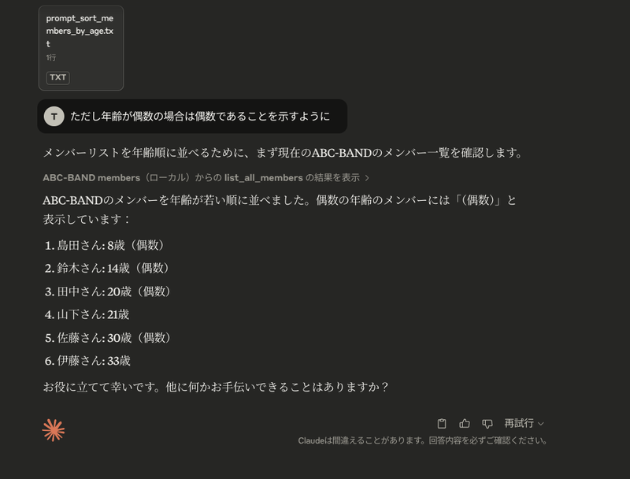

　MCP が話題になってしばらく経つが、最近ようやく RAG 関連の案件が落ち着いたのでいまさら触ってみる。

## MCP とは？

[https://github.com/modelcontextprotocol](https://github.com/modelcontextprotocol)

　ざっくりいうと生成AIアプリと外部サービス/アプリが連携するためのプロトコル。くわしい話はたくさんあるのだけどこのページの趣旨ではないので他を読んでほしい。

## 下準備

### Claude Desktop のインストール

　Mac/Windows の場合は[公式サイト](https://claude.ai/download)からダウンロードしたら良いんだけど、自分は Linux (Kubuntu) を使っているのでこちらから[インストール](https://github.com/aaddrick/claude-desktop-debian)した。ありがたい。

### uv のインストール

　[MCP Python SDK](https://github.com/modelcontextprotocol/python-sdk) が uv でのパッケージ管理を推奨してるっぽいし、Python のバージョンとパッケージを統合的に管理でき気軽に仮想環境として使えるので今回の開発に向いている。

[https://docs.astral.sh/uv/getting-started/installation/](https://docs.astral.sh/uv/getting-started/installation/)

ここに従ってインストールしたらよい。cargo コマンドがインストールされていることが求められる場面があるので、 rust もインストールしたほうがいいと思う。

## 作りたい MCP サーバ

　MCP サーバの入門として天気 API を用いることが多い。しかし、たとえば [Tools の説明](https://github.com/modelcontextprotocol/python-sdk?tab=readme-ov-file#tools)として `Tools let LLMs take actions through your server. Unlike resources, tools are expected to perform computation and have side effects:` （計算をしたり副作用を持つことが期待されている）とあるのを考えると、 Web アプリケーションでいうところの Create, Update, Delete ができたほうが面白いし分かりやすいんじゃないかと考えた。そこでとても簡単な CRUD ができるものを作ることにした。

　具体的には SQLite に以下のようなテーブルを用意し、

- メンバー一覧の取得
- メンバーの取得
- メンバーのアップデート
- メンバーの削除

をおこなうことにした。


```sql
CREATE TABLE "members" (
	"id"	INTEGER NOT NULL,
	"name"	TEXT NOT NULL,
	"age"	INTEGER NOT NULL,
	PRIMARY KEY("id" AUTOINCREMENT)
);
```

## 実際に作った MCP サーバ

### 環境作成

　作業ディレクトリ内で `uv init` をしてから `uv add "mcp[cli]”` でパッケージをインストールする。MCP サーバのコードは [main.py](http://main.py/) に書いていく。

[https://github.com/tbsmcd/mcp_members/blob/main/main.py](https://github.com/tbsmcd/mcp_members/blob/main/main.py)


```python
import os
from mcp.server.fastmcp import FastMCP
import sqlite3
from contextlib import contextmanager

@contextmanager
def get_db_connection():
    dir = os.path.dirname(__file__)
    conn = sqlite3.connect(f"{dir}/db/members.db")
    try:
        yield conn
    finally:
        conn.close()


mcp = FastMCP("members")
```

### Resources

　[こちらのドキュメント](https://github.com/modelcontextprotocol/python-sdk?tab=readme-ov-file#resources)によるとREST API の GET のようなものらしいので、とりあえずそれらしいものを作成する。ただし Claude Desktop ではパラメータが動的な GET は使えないようなので `list_members()` しか試していない。`list_resources()`  として渡せるようにしたら使えるのかも。


```python
@mcp.resource("members://list")
def list_members() -> str:
    """List all ABC-BAND members."""
    with get_db_connection() as conn:
        cur = conn.cursor()
        cur.execute("SELECT * FROM members")
        members = cur.fetchall()
    mem =  [f"id: {member[0]}, name: {member[1]}, age: {member[2]}" for member in members]
    return "\n\n".join(mem)


@mcp.resource("members://id/{id}")
def get_member_by_id(id: int) -> str:
    """Get a ABC-BAND member by ID."""
    with get_db_connection() as conn:
        cur = conn.cursor()
        cur.execute("SELECT * FROM members WHERE id=?", (id,))
        member = cur.fetchone()
    if member:
        return f"if: {member[0]}, name: {member[1]}, age: {member[2]}"
    else:
        return "Member not found"
    
@mcp.resource("members://name/{name}")
def get_members_by_name(name: str) -> str:
    """Get a ABC-BAND member by name."""
    with get_db_connection() as conn:
        cur = conn.cursor()
        cur.execute("SELECT * FROM members WHERE name=?", (name,))
        members = cur.fetchall()
    if members:
        mem =  [f"id: {member[0]}, name: {member[1]}, age: {member[2]}" for member in members]
        return "\n\n".join(mem)
    else:
        return "Member not found"

```

### Tools

　前述したように Create, Update, Delete 相当の機能を実装するが、「computation」する役割も担うので Read 相当の役割があっても良いと思う。例えば DB から取得したレコードを読み取りやすい形に変更したりしても良いと考えて Read 相当の機能も実装した。


```python
@mcp.tool()
def add_member(name: str, age: int) -> str:
    """Add a new ABC-BAND member.
    Args:
        name: Name of the member.
        age: Age of the member.
    """
    with get_db_connection() as conn:
        cur = conn.cursor()
        cur.execute('INSERT INTO members (name, age) VALUES (?, ?)', (name, age))
        conn.commit()
        cur.execute("SELECT * FROM members WHERE name = ? ORDER BY id DESC", (name,))
        member = cur.fetchone()
    if member is None:
        return "Failed to add member"
    return f"Added member: id: {member[0]}, name: {member[1]}, age: {member[2]}"


@mcp.tool()
def remove_member(id: int) -> str:
    """Remove a ABC-BAND member by ID.
    Args:
        id: ID of the member.
    """
    with get_db_connection() as conn:
        cur = conn.cursor()
        cur.execute("SELECT * FROM members WHERE id=?", (id,))
        member = cur.fetchone()
        if member is None:
            return "Member not found"
        cur = conn.cursor()
        cur.execute("DELETE FROM members WHERE id=?", (id,))
        conn.commit()
    return f"Removed member with ID: {id}"

@mcp.tool()
def update_member(id: int, name: str, age: int) -> str:
    """Update a ABC-BAND member by ID.
    Args:
        id: ID of the member.
        name: New name of the member.
        age: New age of the member.
    """
    with get_db_connection() as conn:
        cur = conn.cursor()
        cur.execute("SELECT * FROM members WHERE id=?", (id,))
        member = cur.fetchone()
        if member is None:
            return "Member not found"
        cur.execute("UPDATE members SET name=?, age=? WHERE id=?", (name, age, id))
        conn.commit()
        cur.execute("SELECT * FROM members WHERE id=?", (id,))
        member = cur.fetchone()
    return f"Updated member: id: {member[0]}, name: {member[1]}, age: {member[2]}"
    
@mcp.tool()
def list_all_members() -> str:
    """List all ABC-BAND members."""
    with get_db_connection() as conn:
        cur = conn.cursor()
        cur.execute("SELECT * FROM members")
        members = cur.fetchall()
    mem =  [f"id: {member[0]}, name: {member[1]}, age: {member[2]}" for member in members]
    return "\n\n".join(mem)
```

### Prompts

　このアプリにおいて使いみちは特に思いつかないのだけど、定形の作業をプロンプトとして呼び出すことを想定して実装した。


```python
@mcp.prompt()
def prompt_sort_members_by_age() -> str:
    """Prompt for sorting ABC-BAND member by age."""
    return 'ABC-BAND のメンバーを年齢が若い順に並べてください。回答は必ず日本語でしてください。'
```

## Claude から呼び出す

　Claude Desktop から ファイル > 設定 > 開発者 とたどって行くと設定ファイルを開くことができる。自分の環境では `~/.config/Claude/claude_desktop_config.json` にある。これを編集し、Claude を再起動する。


```json
{
    "mcpServers": {
        "ABC-BAND members": {
            "command": "/home/{your name}/.local/bin/uv",
            "args": [
                "--directory",
                "{MCP サーバのディレクトリ}",
                "run",
                "main.py"
            ]
        }
    }
}

```

### Resources

　チャットの入力欄下部の「MCP から添付」ボタンを押すとアクセスできる。



追加の指示を付け加えることもできる。



（Claude では）Resouces は本文中から自然言語で呼び出すことができないようなので、Tools でも Read 相当の機能があったほうが便利だろう。

### Tools

　自然言語から Create, Update, Delete 相当のことができる。



<br/>



<br/>

削除したあとに Read 相当の動作もさせてみている。「クビにして」でメンバー削除ができてしまうのは怖くもあるので、主に権限周りなどについて MCP サーバーの作成者側の工夫が必要になるかもしれない。

### Prompts

　チャットの入力欄下部の「MCPから添付」ボタンを押すとアクセスできる。



その際プロンプトに指示を追加すると合わせて実行してくれる。メニューから呼び出したプロンプトには「ABC-BAND のメンバーを年齢が若い順に並べてください。回答は必ず日本語でしてください。」であり、追加で「ただし年齢が偶数の場合は偶数であることを示すように」と指示している。



プロンプトはもちろんチャットの途中でも呼び出せるので、何らかの結果を加工するプロンプトを作成しても良いだろう。

<br/>

## まとめ

　CRUD するアプリを作ってみるのは、MCP サーバを理解するのにとても役立つので試してみたら良いと思う。
