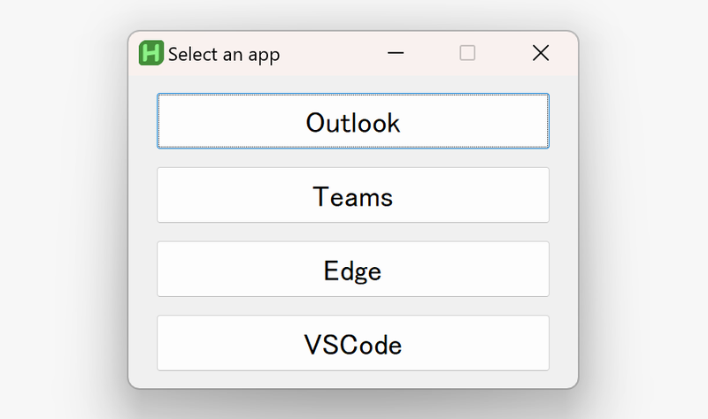

## 導入の経緯

　今月[アバナード](https://www.avanade.com/ja-jp/about-avanade)に入社した。リンク先に「アクセンチュアとマイクロソフトのジョイントベンチャーとして誕生した」とあるように、マイクロソフトのテクノロジーに強い会社であるアバナードでの標準的な PC の OS は Windows だ。もちろん自分に支給されたマシンも Windows 11 Enterprise 搭載機。メモリは32GB載ってて本体も軽いし最高なんだけど、問題は自分が Windows に慣れていないこと。いまどきの Windows は WSL2 で本物の Linux を使えるのでその点で問題はないのだが、ホストマシンの操作はひとまず自分の使いやすいようにしておきたい。そこで軽くググった結果 AutoHotkey が良いらしいと分かったので導入してみることにした。

　

今回導入したのは v2.0 系なのでこちらのドキュメントを参考にされたい。

- [https://ahkscript.github.io/ja/docs/v2/](https://ahkscript.github.io/ja/docs/v2/)

## AutoHotkey (AHK)とは？

　[こちら](https://ja.wikipedia.org/wiki/AutoHotkey)を参照のこと。`*.ahk` ファイルのショートカットをスタートアップフォルダに入れておくことで Windows 起動時に設定を有効化できる。

## 設定したこと

### ショートカット


```plain text
/*
===================================
ショートカット
===================================
*/
/*
 Esc で IMEオフ + Esc 送出
 Google IME の設定で F12 に「IME無効化」を割り当てている
 $ は Esc の無限ループ防止のため
*/
$Esc::Send '{F12}{Esc}'
; mac 風にスクリーンショット
^+4::Send '{PrintScreen}'
```

- Vim を使う際に Esc を押したあと IME 有効だとウザいので無効化
	- IME 側で F12 に無効化を割り当てている必要がある
	- mac の Karabiner だと標準で選べる設定だからどうしても欲しい
- mac のスクリーンショットのショートカットが染み付いているのでこれで上書き

### アプリケーションの状態変更関数

- そのアプリケーション・ウインドウが存在してたら
	- ウインドウが Active なら
		- 一番下に移動
		- 他のアプリのウインドウを Active に
	- ウインドウが Active でなければ
		- 先頭に
		- Active に
- アプリケーション・ウインドウが存在してなかったら
	- コマンドを実行してアプリを起動


```plain text
/*
title: Window Titles https://ahkscript.github.io/ja/docs/v2/misc/WinTitle.htm
cmd: アプリを起動するためのコマンド
*/

switch_app_status(title, cmd) {
	if WinExist(title) {
		if WinActive() {
			WinMoveBottom
			if WinExist( , , title) {
				WinActivate ; `title` 以外の見つかったウインドウがアクティブになる
			}
		} else {
			WinMoveTop
			WinActivate
		}
	} else {
		Run cmd
	}
}
```

### ホットキーでアプリを表示/非表示を toggle

　mac でいうところの iTerm2 のホットキー機能


```plain text
/*
===================================
ホットキー
アプリをトグルでアクティブ/インアクティブ
アプリが起動していない場合は起動
===================================
*/

/*
Ctrl + Enter Windows Terminal
*/
^Enter::
{
	switch_app_status("ahk_exe WindowsTerminal.exe", "wt -p Ubuntu")
}


/*
Ctrl + \ エクスプローラー
*/
^\::
{
	switch_app_status("ahk_class CabinetWClass", "explorer")
}


/*
Ctrl + 0 VSCode
*/
^0::
{
	switch_app_status("ahk_exe Code.exe", "Code")
}

```

### ランチャ機能（GUI）

1. Shift 2連打でランチャを起動

1. Tab で選択

1. Enter で決定

1. 起動

- Esc でランチャを閉じる

<br/>

自分のよく使うアプリだけを選べるランチャが欲しいのでついでに作った。これが50行程度で作れるのは最高だと思う。

<br/>




```plain text
/*
===================================
GUI
アプリをトグルでアクティブ/インアクティブ
アプリが起動していない場合は起動
===================================
*/
a_outlook(*) {
    switch_app_status("ahk_exe outlook.exe", "start outlook.exe")
}
a_teams(*) {
    switch_app_status("ahk_exe ms-teams.exe", "start ms-teams.exe")
}
a_edge(*) {
    switch_app_status("ahk_exe msedge.exe", "start msedge.exe")
}
a_code(*) {
    switch_app_status("ahk_exe Code.exe", "code")
}
exit_gui(*) {
    If WinExist("Select an app") {
		WinClose
    }
}

/*
Shift 2連打で GUI を起動
Interval <= 400ms
*/
Shift::
{
    if (A_ThisHotkey == A_PriorHotkey && A_TimeSincePriorHotkey <= 400) {
        If WinExist("Select an app") {
            WinActivate
            return
        }
        MyGui := Gui(, "Select an app")
         MyGui.SetFont("s14")
        MyGui.Add("Button", "W250", "Outlook").OnEvent("click", a_outlook)
        MyGui.Add("Button", "W250", "Teams").OnEvent("click", a_teams)
        MyGui.Add("Button", "W250", "Edge").OnEvent("click", a_edge)
        MyGui.Add("Button", "W250", "VSCode").OnEvent("click", a_code)
        MyGui.OnEvent("Escape", exit_gui)
        MyGui.show()
    }
}
```

## 感想

　Windows でも案外自由な設定ができるし、 WSL2 で Linux 生活も送れるし、いい具合に生活できそう。
