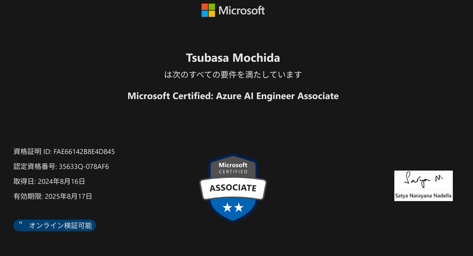
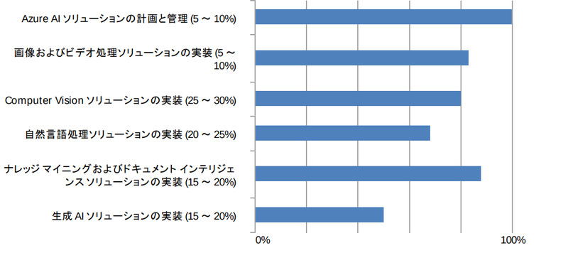

## 成績

　Microsoft Certified: Azure AI Engineer Associate (AI-102) を今日受けて合格した。勉強時間を全然取っていなかったので不合格かギリギリでの合格だと思ったが、862/1000で合格だった。（700点以上で合格）

分野別の成績を見ると生成AIが一番弱い……いちおう生成AIのエンジニアということになっているのに。たぶん生成AI分野がxxx（自主規制）だったのが大きい。

## 対策

　実は2週間前に Microsoft Certified: Azure Fundamentals (AZ-900) を受けて合格したので、 Fundamentals レベルの試験は見易すぎるな……と少し調子に乗ってしまった状態で受験を決めたので、実質的には1週間も勉強しなかったと思う。総勉強時間は15時間から20時間か。

　内容は

- まず Microsoft Learn にある練習問題を解いて出題範囲を掴む（1時間程度）
- 次に Udemy の問題を100問程度解いてソリューションや単語と事例を「何となく」結びつける（英文和訳を含めて6時間程度）
- 最後に MSLearn のコースを1周読んでどこに何が書いてあるかを把握しておく（残り数時間）

という塩梅だった。

一般的にはドキュメント・テキストを読んで勉強し、その後テストで定着をはかるものらしいが、じぶんはテストと自己採点を最初に行うことで（曖昧以上に）知ってる単語を増やしてからドキュメントを読んだほうが効率が良いように感じている。中学の頃からそうしてたのではないか……というか、何も知らない状態で読んでも頭に入らないんだけど、世間一般の人たちはどうしてるの？

　また、 Associate レベルの試験では MSLearn を検索できるので、細かい数値などは覚えないようにした。ただし100分間に50問程度を解かなければならないので、いちいち検索する時間もない。自分の場合は7割程度出来たなーという状態から検索し何割か正解率を上げたと思う。

## 試験の形式

　[アバナード井関さんの記事](https://note.com/avakansai/n/ncc226be1221f)ではケーススタディはなかったとあるが、きょうの試験ではケーススタディ→通常（？）問題→ラボ試験という3段階に分かれていた（計51問）。ケーススタディは「あなたはxx会社の社員でxxの仕事をしています。会社の部署とファイル保存は〜」のような前提があり、その上で会社内のいくつかの問題を解決するために Azure AI Searvice をどう使うか？というもの。ラボ試験は実装に近い形でコードの穴埋めなどをした（ような記憶がある）。

　ケーススタディとラボ試験はあとから回答を見直せないのが辛い。ケーススタディは他の問題がヒントにあり得るので仕方ないだろうが、時間の配分が難しいと感じた。

## 総括

　AI-102 は現状 [MCP](https://www.microsoft.com/ja-jp/partner/contents/mcp) ([ja.wikipedia](https://ja.wikipedia.org/wiki/Microsoft_Certification_Program))の AI 系ではもっとも上位の資格なので、これにある程度余裕を持って合格できたのは素直に嬉しい。つぎはセキュリティかデータ分野の Fundamentals を取得しようと思う。（[DP-900](https://learn.microsoft.com/ja-jp/credentials/certifications/azure-data-fundamentals/?practice-assessment-type=certification) , [SC-900](https://learn.microsoft.com/ja-jp/credentials/certifications/security-compliance-and-identity-fundamentals/?practice-assessment-type=certification)）

## 余談

　今回はピアソン VUE の在宅試験を使ったが、今後はなるべく試験会場で受けようと思った。在宅試験のシステムでは他のアプリケーションを閉じていることを検知してから受験を開始する。しかし今回は受験中（半ばぐらい）で急に回答できなくなり、どうやら WSL2 が有効になっているのが原因のようだった。なぜ最初に検知しなかった！！！そして、これに対応する間も試験時間は過ぎていく。

　受験環境のチェックも割と辛いものがある。自分の部屋は物が多いので布団の上で受験した……同じように感じている人がいるので、そちらを参照されたい。

[【AWS】ピアソンVUEオンライン受験にストレスを感じた4つの理由 #AWS認定試験 - Qiita](https://qiita.com/shiva_it/items/bb060ab734867802ae85)
