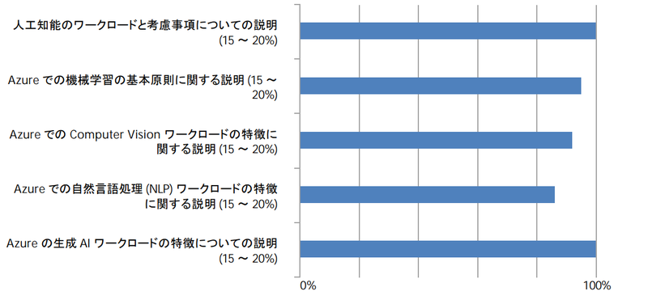

## 成績

　AI-900: Microsoft Azure AI の基礎の学習（Microsoft Certified: Azure AI Fundamentals）をさっき受けてきた。1000点満点のうち942点だった。合格ラインが700点なので割と余裕。時間も20分ぐらい残して終了した。得点の内訳は以下の通り。

## 対策

　自分は去年 JDLA G 検定と E 資格に合格しているので AI についての知識はすでにあり、 Azure 固有の問題についてのみ対策した。まず MS が用意している[練習評価（模擬試験）](https://learn.microsoft.com/ja-jp/credentials/certifications/azure-ai-fundamentals/practice/assessment?assessment-type=practice&assessmentId=26&practice-assessment-type=certification)を何度か解き、出題の範囲をおおよそ把握したうえで[コース AI-900T00](https://learn.microsoft.com/ja-jp/training/courses/ai-900t00) を通読する。コース内の演習はやったほうが良いと思うが、無視しても試験には合格するとは思う。結局賞味数時間が実質的な勉強時間だったのではないか。

## 総括

　AI 系のように事前知識の無い Azure 系の試験も同様に受ける必要があるので、効率的な学習法を模索することが大切だろう。AI 系の発展した試験も早めに受けたい。

 
