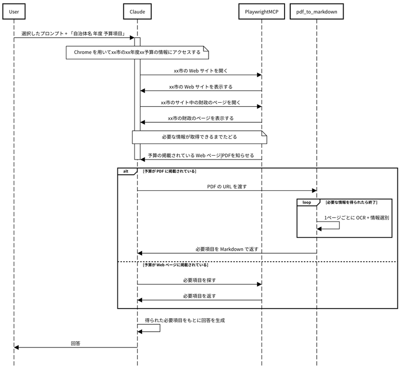

## Playwright MCP を触ってみたい

　Playwright MCP は2025年3月に Microsoft が発表したブラウザ自動化ツール。AI によるブラウザ操作として画期的なところは、アクセシビリティーツリーを採用し、構造化データを扱うことにあるだろう。


```plain text
Key Features
Fast and lightweight: Uses Playwright's accessibility tree, not pixel-based input.
LLM-friendly: No vision models needed, operates purely on structured data.
Deterministic tool application: Avoids ambiguity common with screenshot-based approaches.
```

[https://github.com/microsoft/playwright-mcp](https://github.com/microsoft/playwright-mcp)

Claude Desktop から扱うに当たり、（MCP なのに）ただ単品で使うのもつまらないので、自作の MCP サーバと連携させてみた。

### Playwright MCP のインストール

　筆者の環境は Kubuntu（Ubuntu）。


```bash
sudo npm install -g @playwright/mcp
```

## 作成する AI エージェント

　取得する情報は公共性の高いものということで、自治体の予算情報を選んだ。例えば「滋賀県草津市の2025年度予算のうち教育費はいくらか？」という問いに答えさせる。

質問から回答までの流れを図示してみた。



## 自作した MCP サーバ 

[https://github.com/tbsmcd/local_gov_budget_mcp/tree/main](https://github.com/tbsmcd/local_gov_budget_mcp/tree/main)

- Prompt
	- 以下のような条件を与える
		- 自治体名、年度、項目名は外から与えられる
		- Chrome をもちいて自治体の Web サイトを探索する
		- 金額以外の余計な回答は不要
			- ただしソースは示すように
		- 探索の過程は明示するように
- Tool
	- PDF を OCR して必要な部分だけを Markdown にして返す
		- 必要箇所の無いページの内容は無視する
		- 列挙した項目が含まれる表を対象とする

プロンプトのチューニングなど行っていないので悪しからず。

## Claude の設定

`claude_desktop_config.json` はこのように


```json
{
    "mcpServers": {
        "playwright_mcp": {
            "command": "npx",
            "args": [
                "@playwright/mcp@latest"
            ]
        },
        "local_gov_budget": {
            "command": "/home/tbsmcd/.local/bin/uv",
            "args": [
                "--directory",
                "/path/to/dir/local_gov_budget/",
                "run",
                "main.py"
            ]
        }
    }
}

```

## 動作



滋賀県草津市の2025年度予算から教育費を取得するまでを2倍速で。
