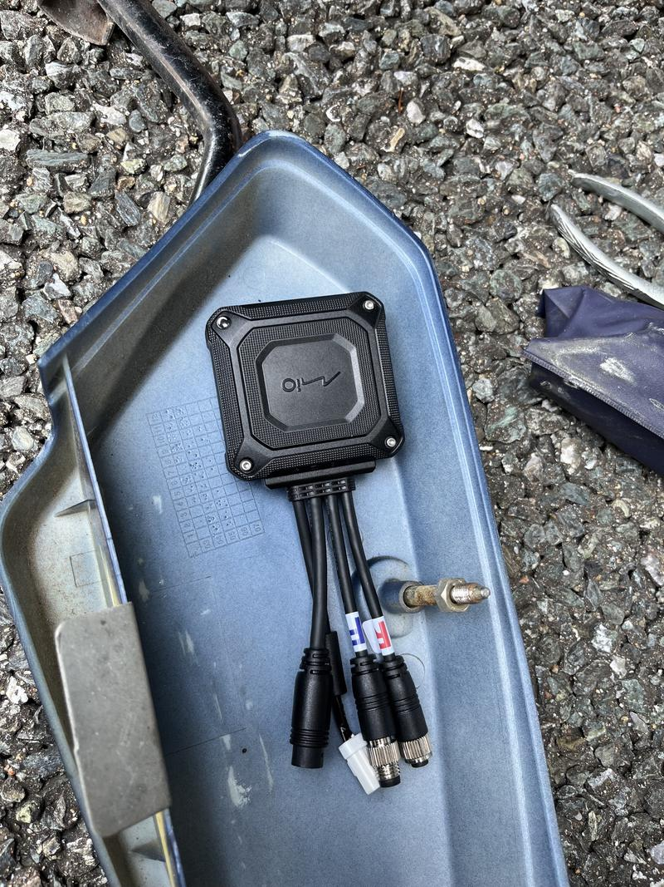
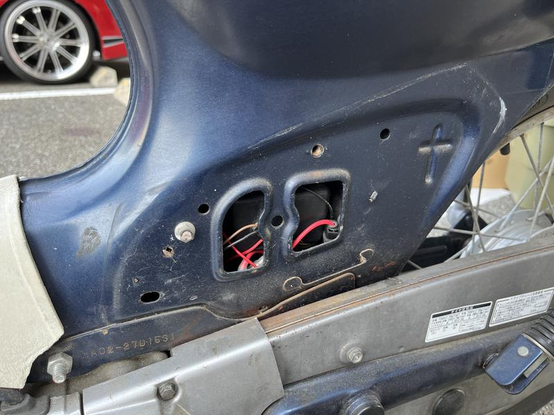
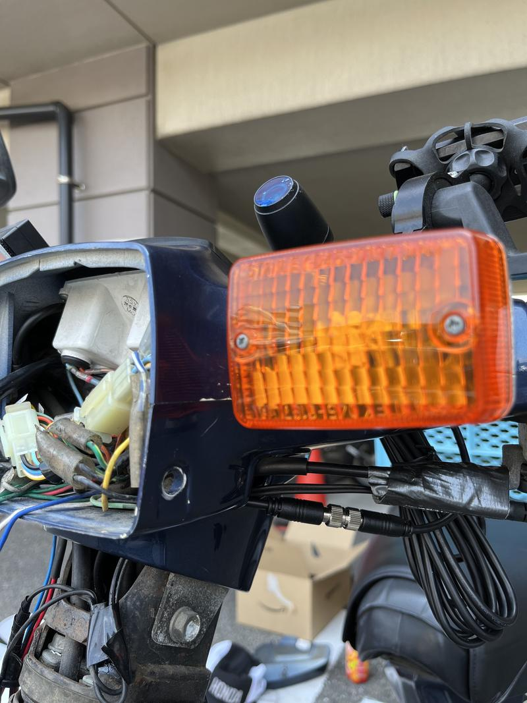
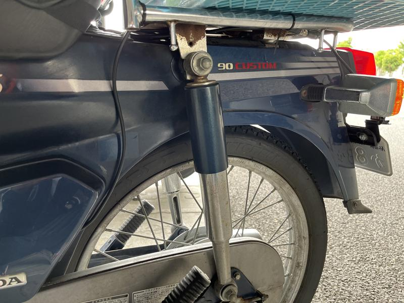
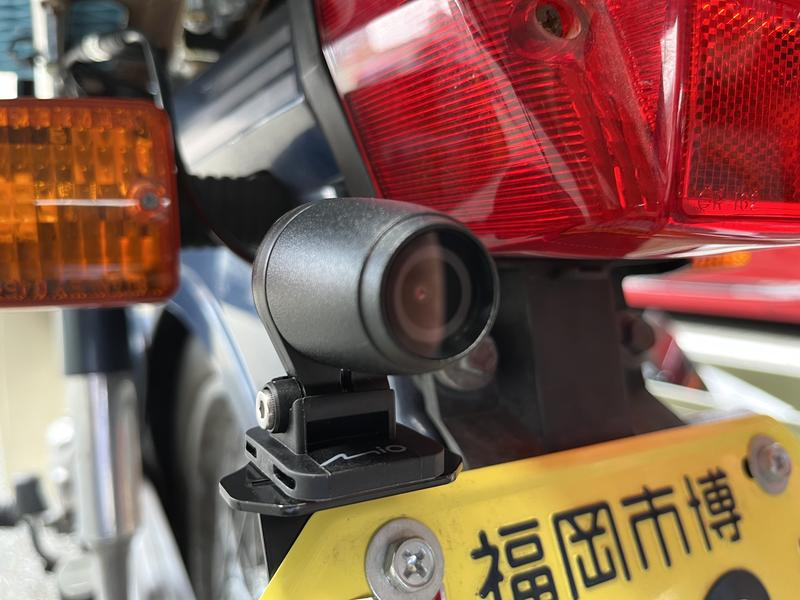
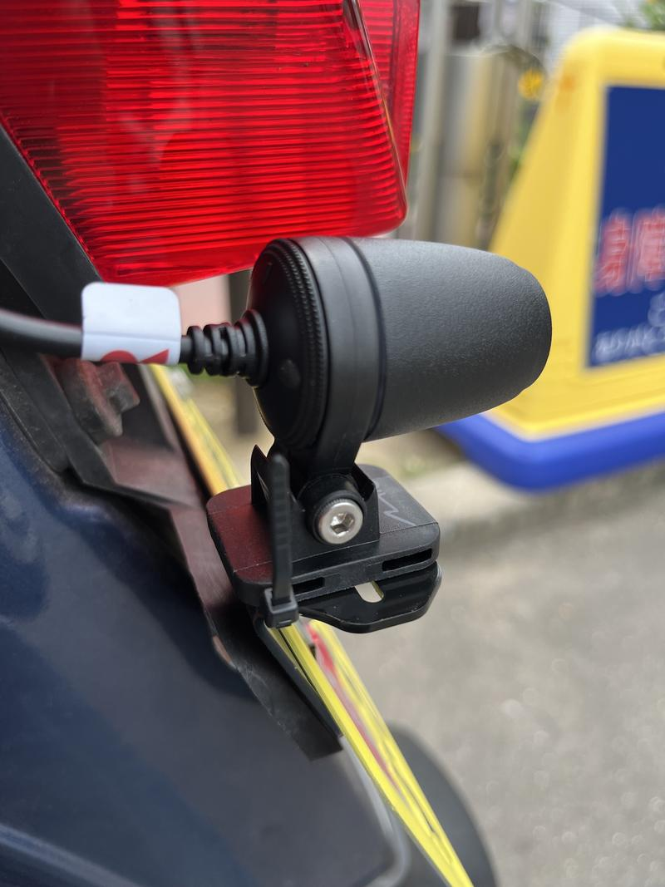
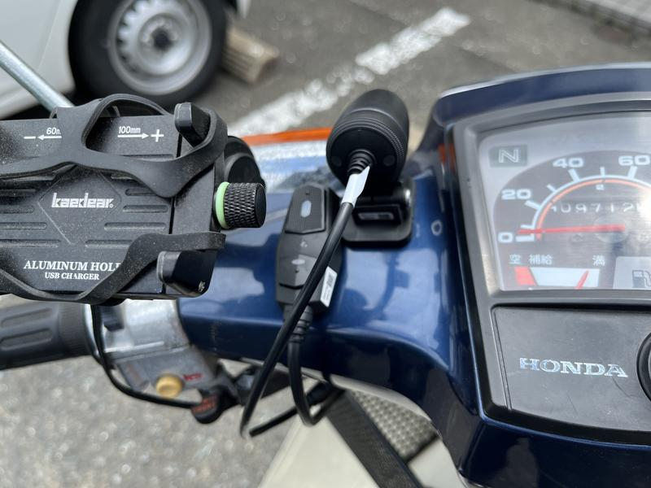
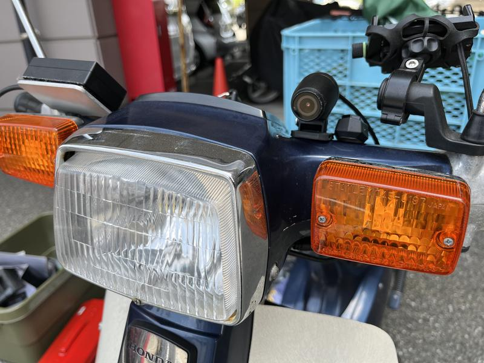

  
## さっそく設置……の前に必要なもの

　スーパーカブの電装品を設置する場合に必ず欲しいものに10mmや12mmのメガネレンチ・ラチェットレンチがあるのだが、これはレッグシールドやバッテリーボックスを開けるために必要なもので、普段のメンテナンス用工具にも含まれているはずなので詳しくは触れない。

　それ以外……初めて電装品を DIY で付ける場合に必要なのが電工ペンチや端子類だ。特に電工ペンチ・クワガタ端子・配線コネクタは今回の取り付けでかならず使うので欲しい。詳しくは製品ページから取扱説明書をダウンロードしてもらいたいが、バッテリーへの接続にクワガタ端子を、ACC電源（イグニッションがオンのときに通電するアクセサリ電源。旧式のスーパーカブの場合はウインカーリレーから取ることが多いと思う）からの分岐に配線コネクタを使う。配線コネクタを使いたくない場合は[ギボシタイプの分岐ハーネス(Amazon)](https://amzn.to/3yk1lJp)を使うもの良い。おれは結構ギボシタイプのものが好きで、一回配線コネクタで取ったものをリファクタリングしてスッキリ丈夫にしたり。

## ケーブル類をどこに通すか？

　どの線をどこにつなげるかという話は説明書に書いてあるのでしない。今回は左のサイドカバー裏に本体を設置したので、

- 左サイドボックス内からバッテリーボックスの間（電源類）
- 左サイドボックスから車体後部（リアカメラ）
- 左サイドボックスからハンドル（フロントカメラとコントローラ）

の3経路を考える必要がある。

### 電源類

　カブのバッテリーボックスは右サイドボックスから車体内部に収まっている。おれのカブは左サイドボックスにも穴が開いているので、そこから電源ケーブルを通した。

 

エーモンのリレーが写り込んでる……

### フロントカメラとコントローラ

　これも上記の穴から通して、メインハーネスと一緒にレッグシールド内を……と考えていたのだが、左サイドボックスとレッグシールドの間は距離が短いのでそこを通しても案外目立たないことがわかった。画像は撮り忘れたけど。メンテナンス性などを考えたら取り回しの楽な方を選んでも良いと思う。あとケーブルがチラ見えするほうがちょっとかっこいい。

出口はヘッドライトケースを通してチョークと同じ穴から出す。余計な配線が背後に見えるけど、これはいい感じに仕舞ってます……

### リアカメラ

　これも内部を通すためにガソリンタンクを取り外すことまで考えていたのだが（カブの後部灯火類はガソリンタンク下を通ってリアキャリア下の穴から外部に出ている）、外を通しても案外良いのでは？と思いやってみた。

全然目立たないし、むしろいい感じの取り回しに見えるからこれで。

　やっぱチラ見えするぐらいのほうがかっこいいのでは？

## カメラとコントローラの設置

　今回リアカメラは[プロトのドラレコマウント(Amazon)](https://amzn.to/3OI3T9u)を使っている。

 

両面テープで貼り付けたあと、脱落防止のタイラップを忘れずに。

　フロント側は脱脂したあと両面テープで貼り付けるだけ。

 

フロント側はケーブルが手元から出ているので、タイラップがなくても脱落→事故とはならないと思う。付けれる場所なら付けたほうが良いとは思うんだけど。

## 作業してみて

　実際にかかった時間は1時間から1時間半程度だった。ケーブルの取り回しを考えるのが15分ぐらい。考えるほうが楽しかったかも。

　使用した感想はまた次回。
