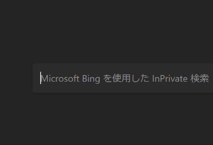

[前回](https://tbsmcd.net/post/my-first-ahk/)の続き。

<br/>

これをやる↓



<br/>

## IME オフになってるのに気付かずタイピングしたとき

　ダルい。基本的にディスプレイを見ていても何文字かは止まらずに打ってしまい、IME を有効にしたあとに再度打つ羽目に。こういう時のための AutoHotkey の設定を先人は残してくれている。

- [https://yuruaki.blog.fc2.com/blog-entry-41.html](https://yuruaki.blog.fc2.com/blog-entry-41.html)

これをリスペクトしつつ、自身が必要な機能を V2.0 系で書き直してみた。

## 実装

- AHK V2.0 系で動く
- Alt 2連打で発火
	- クリップボードの中身は退避する
	- 選択中のテキストが「半角英数-~」のみで構成され、1文字以上あった場合に
		- 選択中のテキストをコピー
		- IME オンにしてコピーした文字列をタイピング
			- （つまり文字列選択をしていない場合などはスルー）
	- クリップボードの中身をもとに戻す
	- 終了

ということをする


```plain text
/*
===================================
ローマ字を再変換
右シフト 2連打で発火 Interval <= 400ms
選択中のテキストが `半角英数-~のみ1文字以上` の場合だけ有効
===================================
*/

RShift::{
    if (A_ThisHotkey == A_PriorHotkey && A_TimeSincePriorHotkey <= 400) {
        clip_data := ClipboardAll()
        A_Clipboard := ""
        Send "^c"
        ClipWait 0.5
        copied := String(A_Clipboard)
        if (RegExMatch(copied, "^[0-9a-zA-Z\-\~]+$")) {
            Send "{F13}" copied
        }
        A_Clipboard := clip_data
        return
    }
}
```

ポイントとしては ClipWait が必要なところ。直前に `Ctrl + c` を送出しているのだが、送出する命令はつまりクリップボードの状態など関係なく次に進む。それを防ぐためにクリップボードへの代入を待機することが必要となる。

`String(A_Clipboard)` は何か文字列以外のものをコピーしてしまった場合のためだが、不要かもしれない。

`.,` については文を入力するに至ることは無いと考えて除外している。
