　ちょうど100kmぐらいのショートツーリング。

　5.5 はこどもの日だが、たまたま子供の世話をしなくても良い日となったので夕方前に帰れるショートツーリングを設定した。じっさいに9時過ぎに出て14時半に帰ってこれたので程よいルートだと思う。

## 筑紫耶馬溪（南畑ダム）

[https://goo.gl/maps/LmfKePMxiJwTMWJB8](https://goo.gl/maps/LmfKePMxiJwTMWJB8)

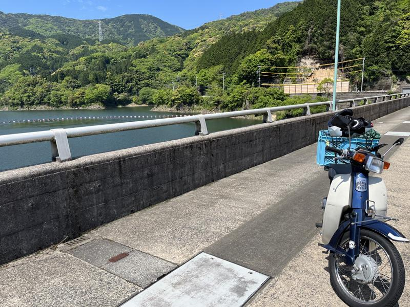

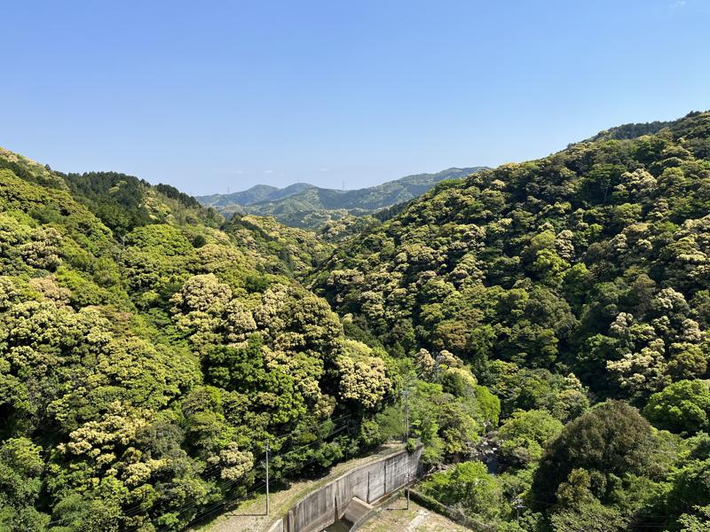

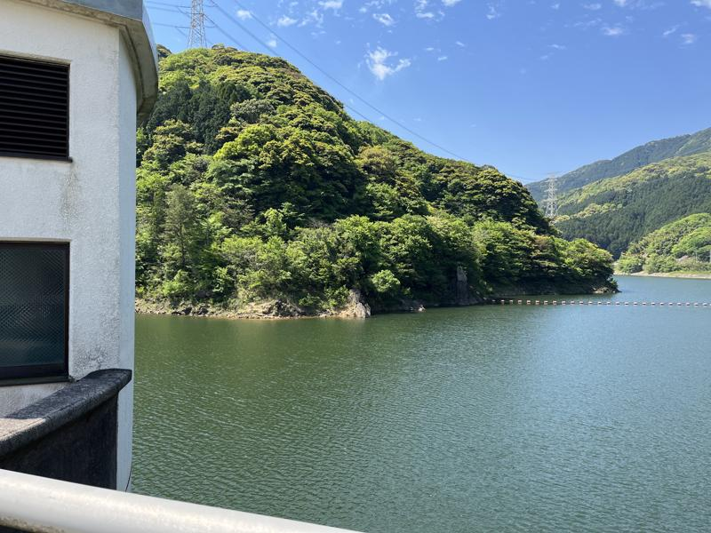

 

　豊前国にある耶馬渓（大分県中津市）にちなんで付けられたであろう筑紫耶馬溪。ダムの上からなのでよく分からないが、きっとそういう感じなのだろう。ダムの上は車両通行可能かどうかわからなかったので写真だけ撮った。

## 背振山頂広場へ

[https://goo.gl/maps/J4bJbJ77jV3Dr2zy9](https://goo.gl/maps/J4bJbJ77jV3Dr2zy9)

 

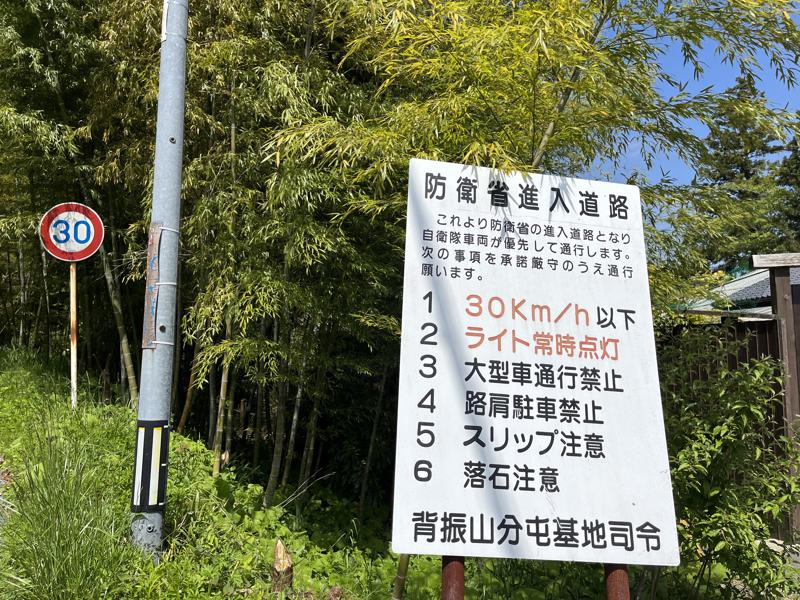

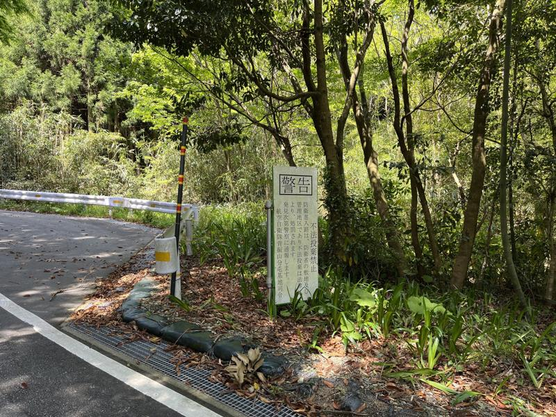

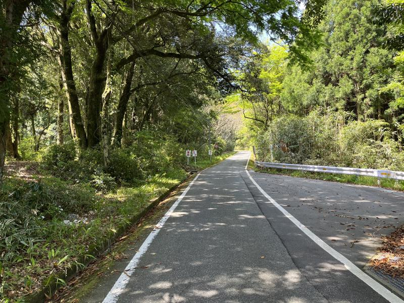

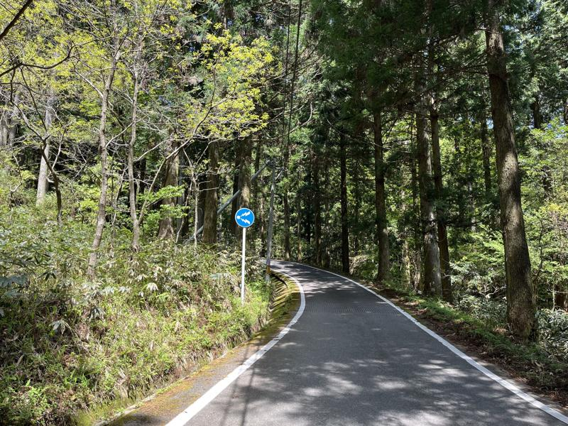

 

　どうやら途中からは防衛省の土地らしく、自衛隊関係の看板があった。夜見たら怖そうな看板もある。「警笛鳴らせ」がやたら多く、いままでにカブで鳴らしたクラクションの総数を余裕でオーバーしたと思う。

 

 

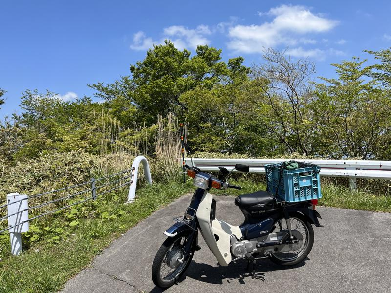

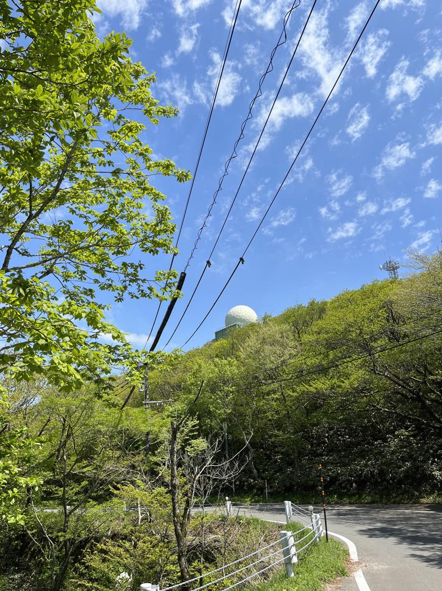

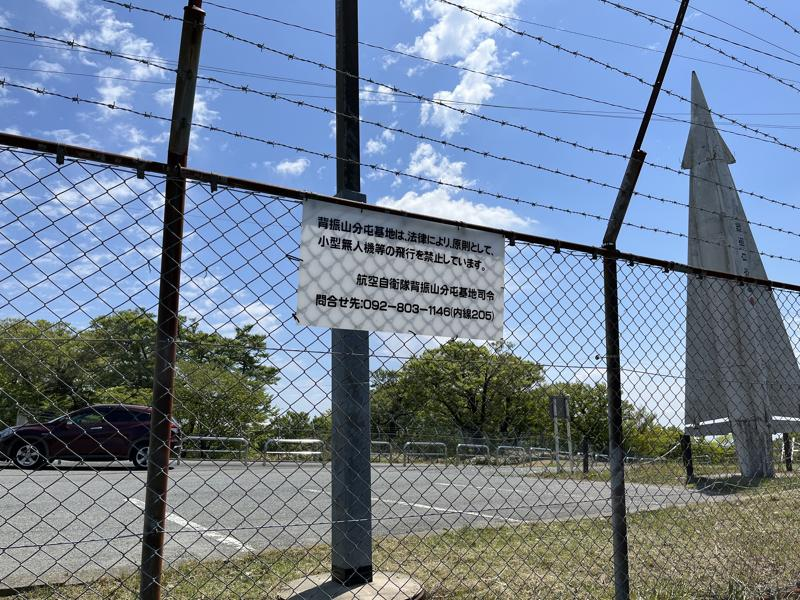

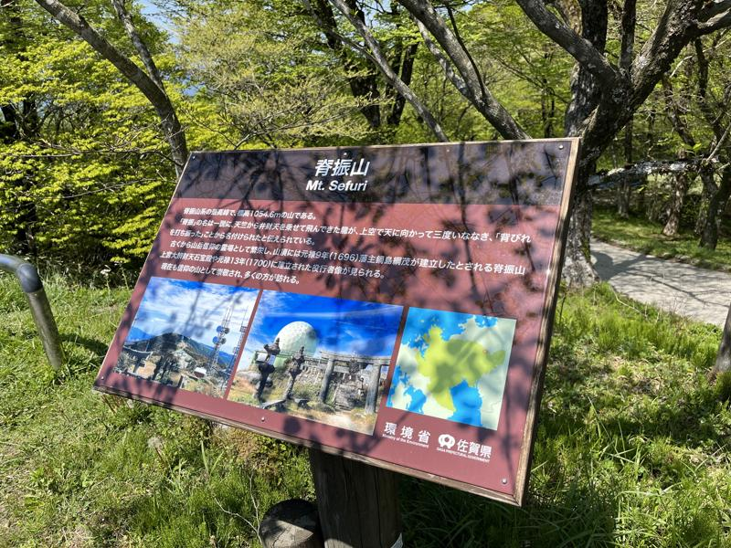

 

山頂広場のとなりが自衛隊施設でアンテナなどが見れる。

 

## 吉野ヶ里町 山茶花の湯

[https://goo.gl/maps/E4EpBGgsWsj26NRJ8](https://goo.gl/maps/E4EpBGgsWsj26NRJ8)

 

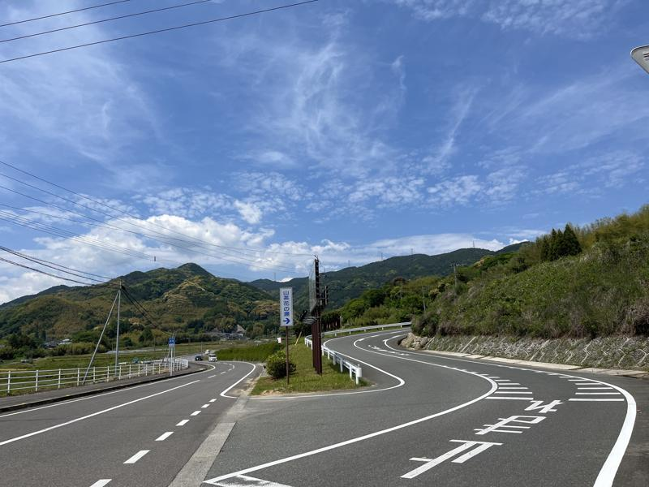

 

　山が広がっていて眺めが良い。 JAF 会員割引がある。

## 3号線（バイパス）で博多へ

　みやげにウインナーを買ったので、帰りは最短経路で帰る。鳥栖経由で3号線へ。
