## ルートと距離

[ルート（Google マップ）](https://www.google.com/maps/d/u/0/edit?mid=1pdcC7hcIiA5bCjiZ2FL5jUjmu3VeVTQ&usp=sharing)

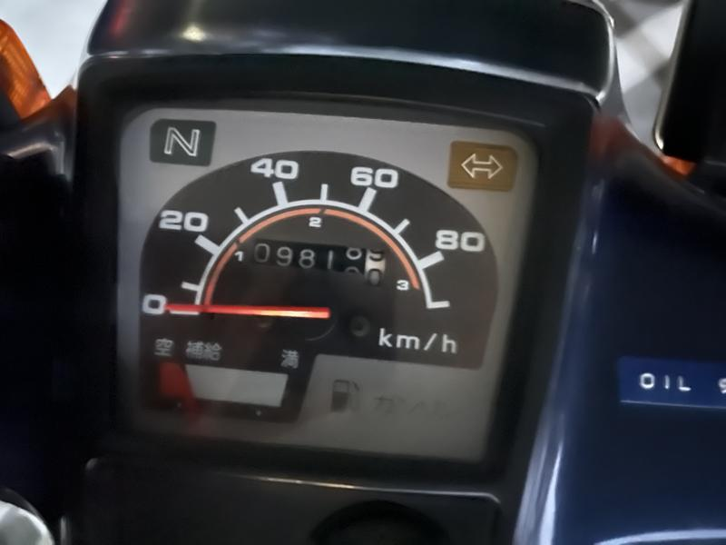

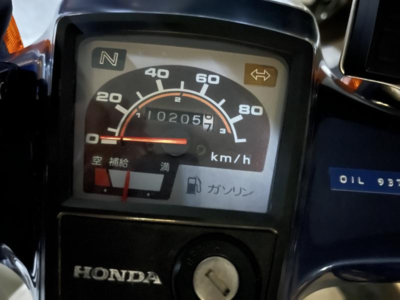

　メーター読みで387km。福岡・筑豊・日田・耶馬渓・日出・国東半島一周・小倉・そして福岡。前半は山道、国東半島一周を経て後半は幹線国道がメイン。前半が山道だったので距離は伸びなかったが、それでも東京から名古屋まで行ってお釣りが出るぐらいの距離を走ったことになる。7:00前に自宅を出て、帰宅したのは21時過ぎだった。

## 教訓

- ケツが死ぬからそれなりの装備を
- 腰痛の不安のある人はサポーターを
- 思わぬ関節痛に見舞われる可能性を考える
- できれば夜明けの出発を
- 熱中症対策を
- 自宅へのショートカットをプランに入れる
- Google マップの高速道路除外を信用しない

### ケツが死ぬからそれなりの装備を

　カブは状態が直立した状態で乗るので荷重が座面に集中する。今回シートには[ゲルザブ](https://amzn.to/3NSYhZb)を装着していたのだが、それでも尻に痛みは出た。こまめな休憩と体操で大したことはなかったが、1日で終わらない連続ライドを考えている人はゲル付きのインナーなどを穿いておいたほうが良いかもしれない。

### 腰痛の不安のある人はサポーターを

　普段は何もしなければ腰がいたいことがないのだけど、実際に軽い腰痛に襲われた。自分の場合は中殿筋が固まることで腰痛になることが多いので休憩中のストレッチで解消出来たが、サポーターを持っていると安心。

### 思わぬ関節痛に見舞われる可能性を考える

　カブは小排気量とはいえ単気筒なので振動が大きい。今回左手首に軽い痛みがあった。1日のツーリングなので特に対策は不要だったが、連続ライドを考えているならばテーピング等を持っておくと良さそう。

### できれば夜明けの出発を

　今回は帰宅時に国道3号を使うことになった。夜の国道は怖いので出発が早いほうが良い。また夏のツーリングなので自宅近くの市街地を朝の渋滞しない時間帯に抜けるのが暑さ対策になる。

### 熱中症対策を

　常にアクエリアスかポカリのペットボトルを携行して休憩で飲むことにしていた。引っ張って飲めるペットボトルキャップを持っておくほうが良いと思う。

### 自宅へのショートカットをプランに入れる

　予定が狂うことがあるので周回コースにして途中で帰ることが可能にしたら安心できる。今回は不要だったが、無理なスピードを出す必要がなく安心できた。

### Google マップの高速道路除外を信用しない

　除外設定していても無料の中津日田道路を案内してくる。自動車専用道は高速道路なんだよ？

### 写真

遠賀川源流

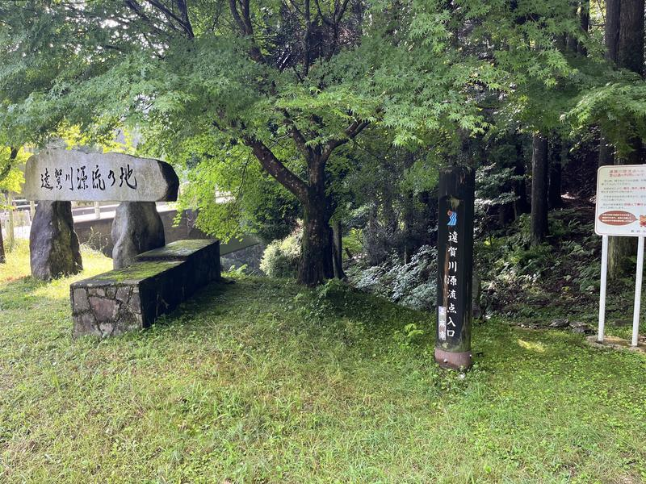

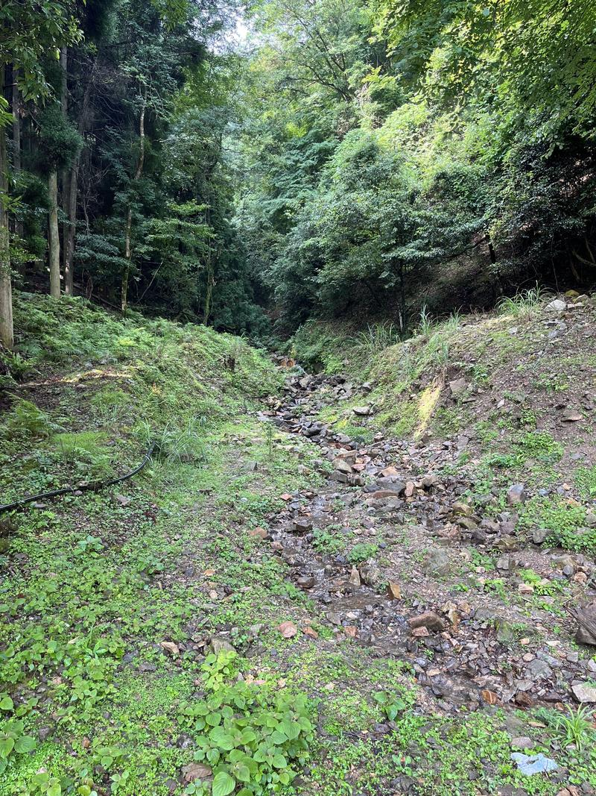

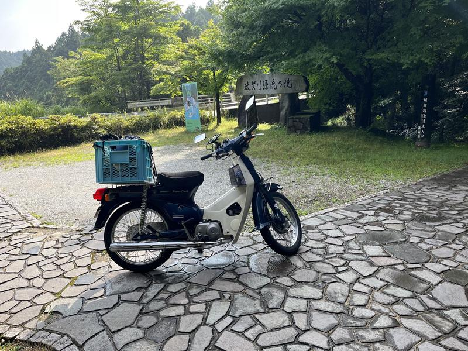

日田・大原八幡

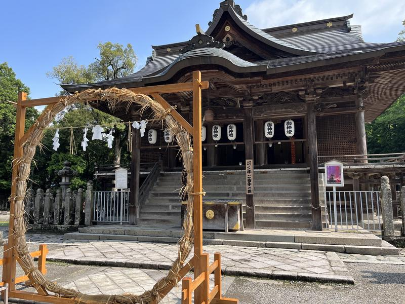

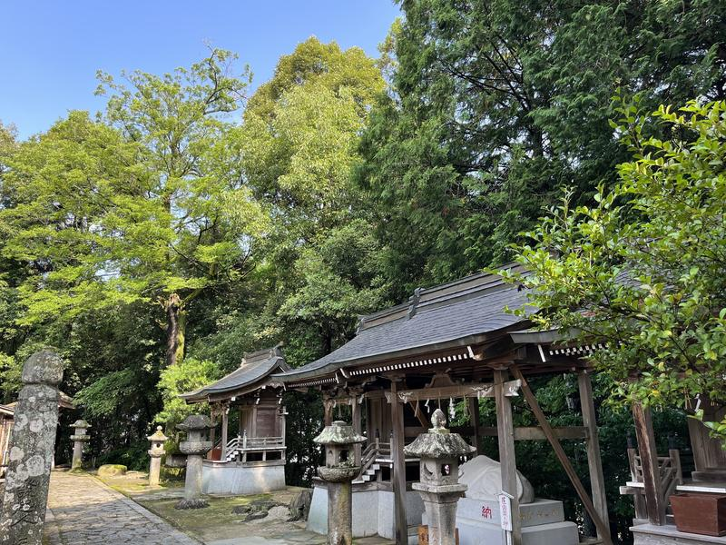

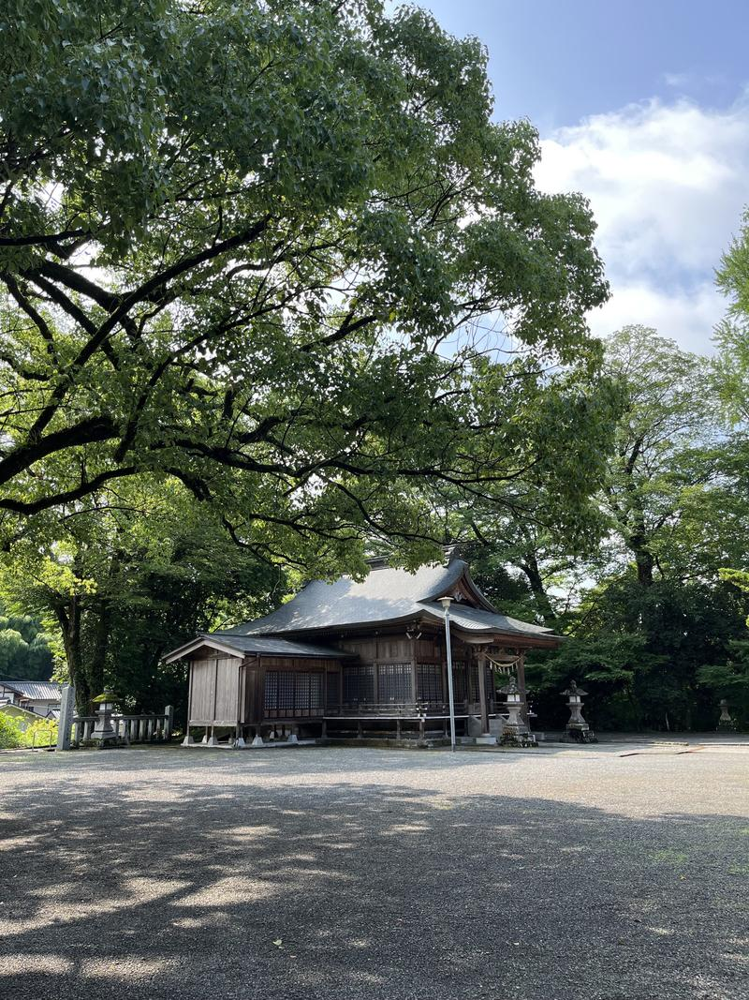

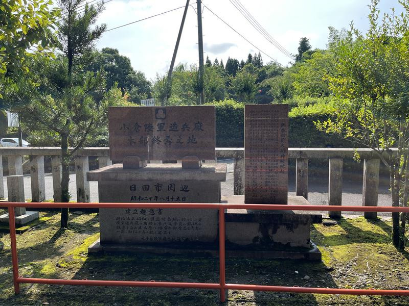

耶馬渓ダム

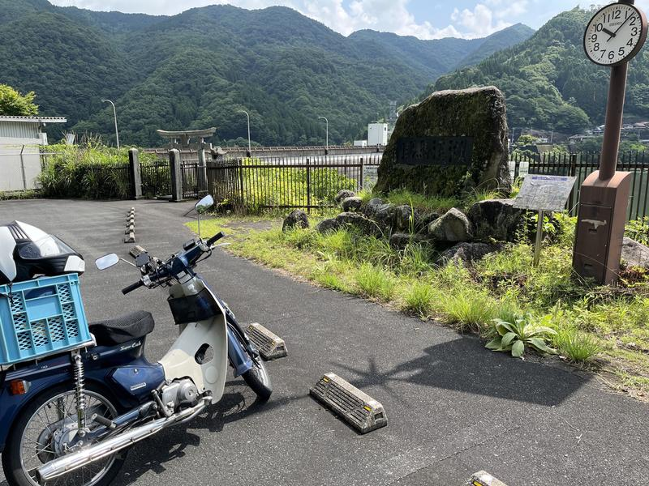

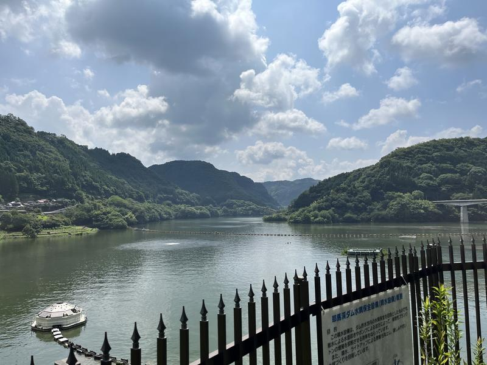

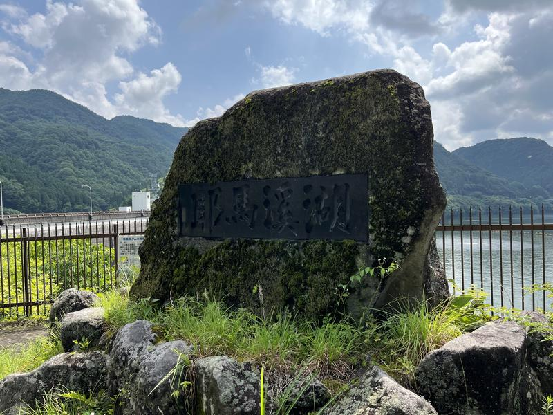

日出でカレイ

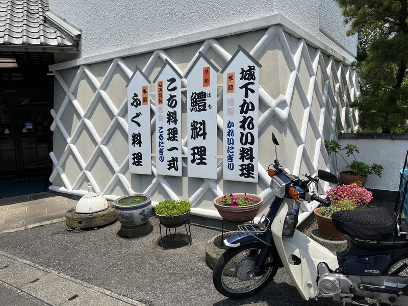

国見の道の駅

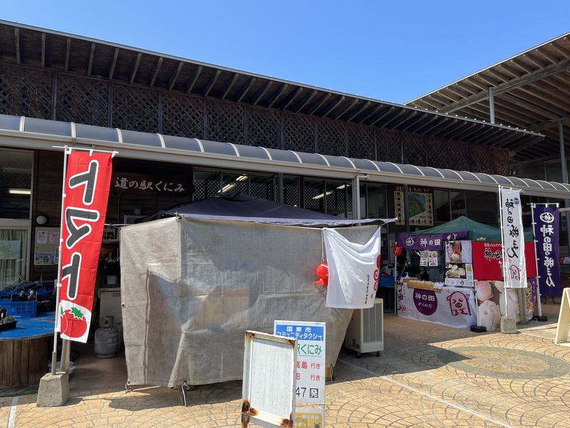

難読地名・福岡県京都郡苅田町神田町（みやこぐんかんだちょうじんでんちょう）

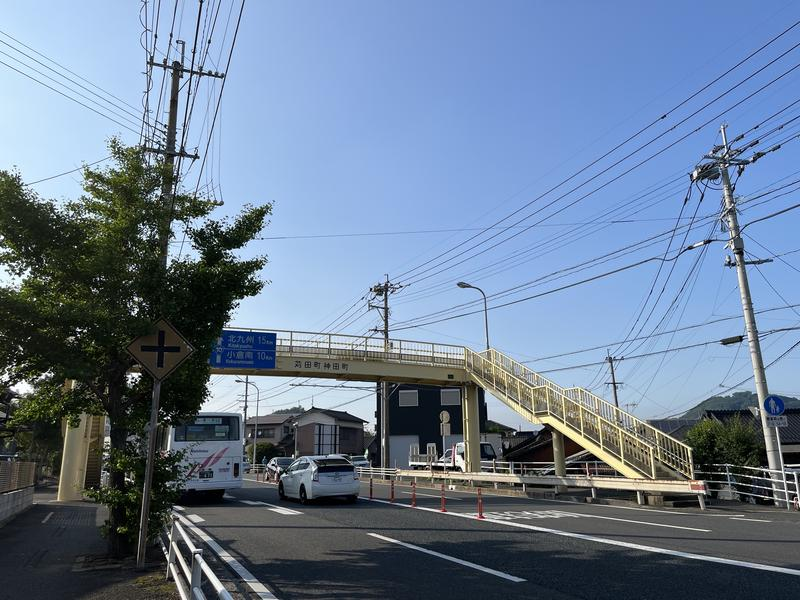

 
