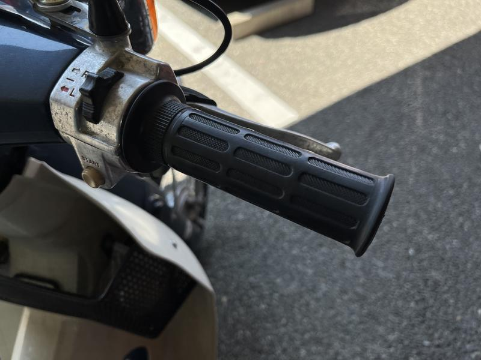
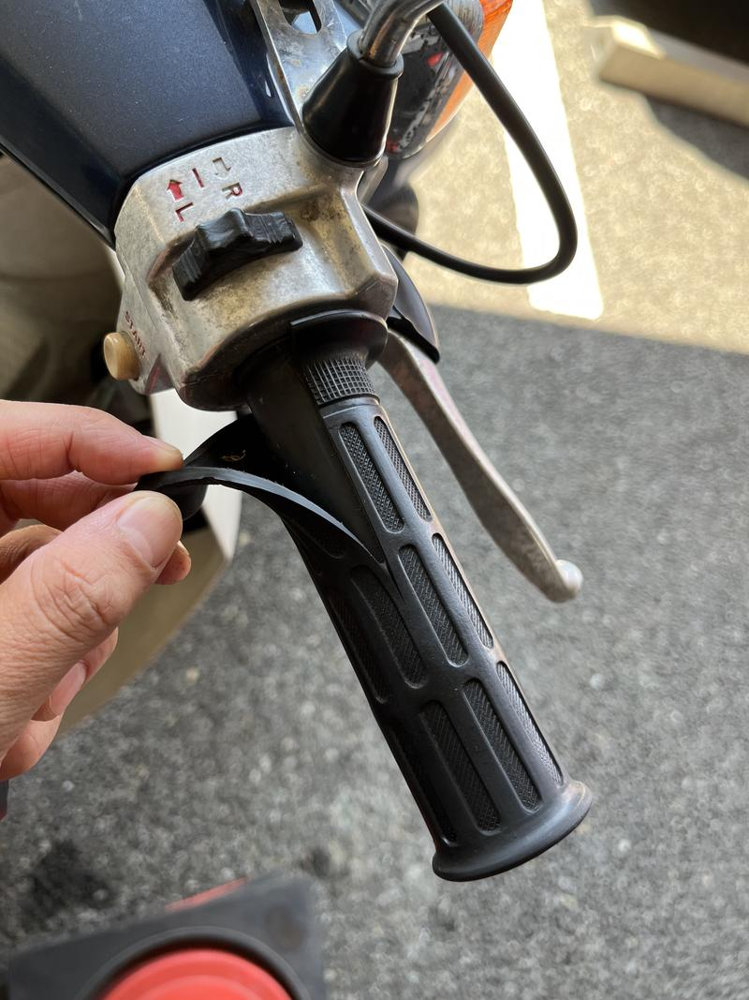
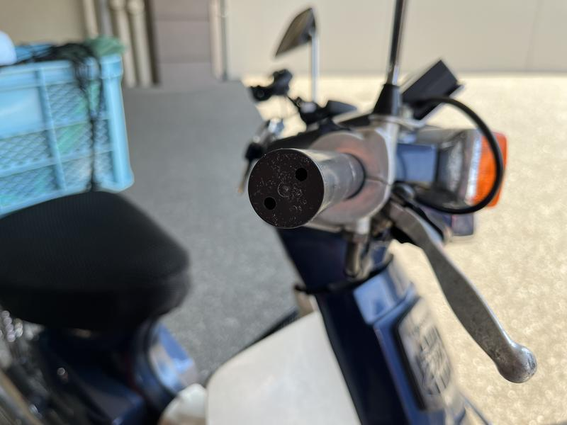
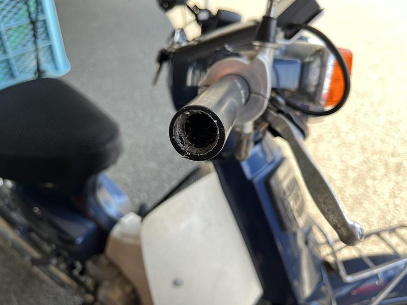
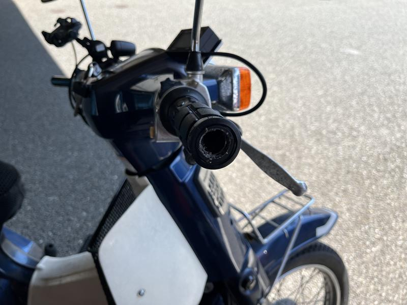
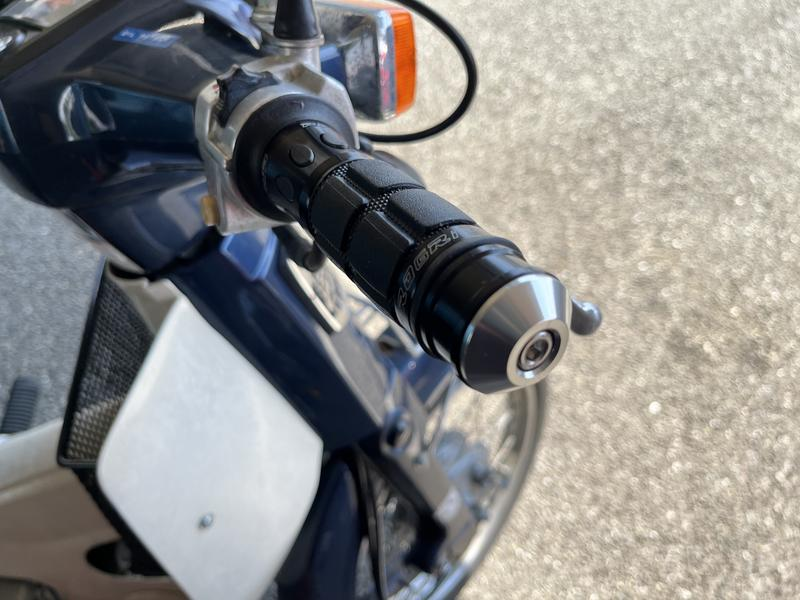
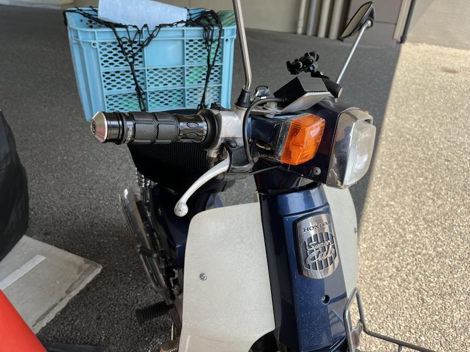
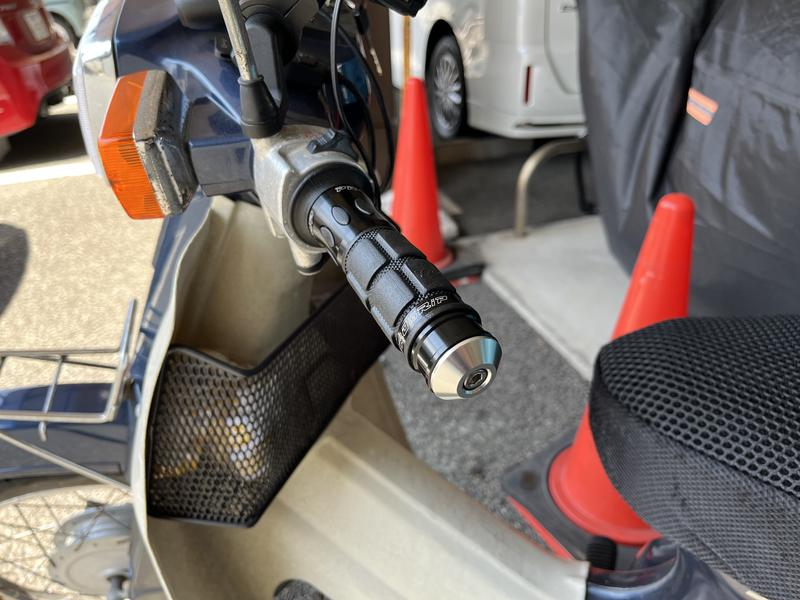
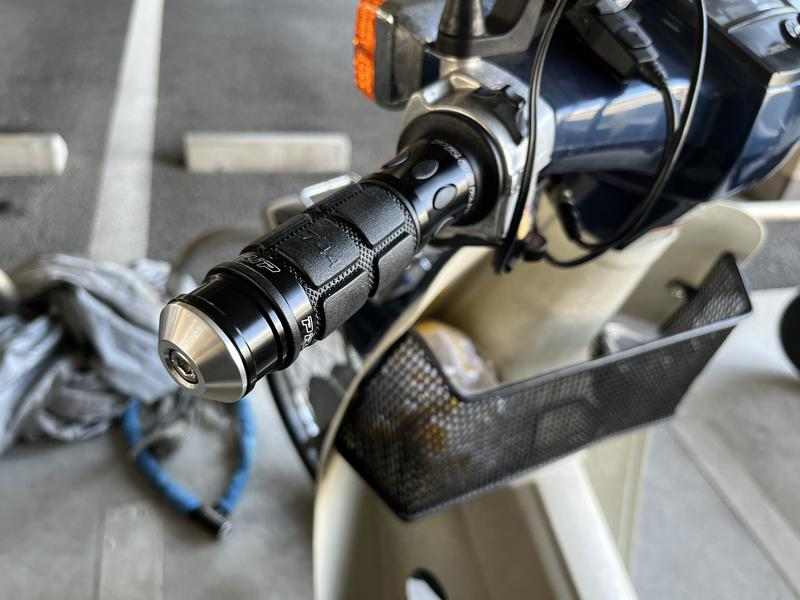

注意: 対象車輌はスーパーカブ90カスタム（HA02, C90CM5）

## カブの振動は割とキツい

　[前回](https://tbsmcd.net/post/supercub-390km-per-day/)ツーリングで1日に390km走った結果、スーパーカブの振動は案外手にくることがわかった。カブは小排気量ながら振動が強いほうだとは思っていたが、普段そこまでの距離を乗らないので手のダメージについては想定していなかった。振動対策としては耐震グリップなどもあるが、今回はバーエンドウェイトを使ってみた。

## バーエンドウェイトを使う理由

　耐震グリップではなくバーエンドでの対策をした理由はコンビニからツーリングまでをこなせる車体にしたいからだ。耐震グリップはどうやらその性質上柔らかく削られやすいようで普段から頻用するのにはデメリットとなる。また街乗りの最中はスロットルのオン / オフが頻繁なので柔らかいものより硬いものの方が好ましいと思っている。一方、バーエンドウェイトはアクセルの開閉に影響があまりないし、それでいて振動は抑制できる。またそれなりのグリップであれば耐震でなくとも純正よりマシだろう。以上からバーエンドウェイトの重さで振動を抑制しつつ柔らかすぎないグリップを併用するのが良いのではないかと考えた。

## 作業

### 必要なもの

- バーエンドウェイト
- グリップ
- カッターナイフ
- サンドペーパー（あれば）
- 脱脂剤
- グリップボンド
- リーマー

バーエンドウェイトは[こちら](https://amzn.to/3IY8a7g)を、グリップは[こちら](https://amzn.to/3PQFe34)を購入。ともにデイトナ製。リーマーは樹脂に穴が開くものでそれなりに径があれば良いだろう。サンドペーパーはなくてもいける。

### 丸目のカブは注意！！

　スーパーカブ（キャブ車）の丸目（スタンダード・デラックス）はハンドルの外径が左右同一という珍しい仕様になっているのでカブ用のものを購入する必要がある。自分のカブは角目（カスタム）なので汎用（ミリバー用）を使用できる。

### 工程

　グリップをカッターで切る。右側はスロットルコーンが樹脂製なのでなるべく傷つけないように。左側は多分適当にやっても大丈夫。

 

　スロットルコーンは貫通していないのでリーマーで穴を開けて広げる。画像では汚いが、バーエンドを付けたときに削り残したバリが干渉することもありそうなのでカッターで削っておくと良い。たぶんサンドペーパーも使えるのでは？

　左は何もしなくて良い。

 

　脱脂・グリップボンド塗布・グリップ装着。削り残しがまだあるが、このあと削った。

 

　右はキツくやりすぎるとスロットルが回らなかったり戻らなかったりするので、確認しながら。左は……

 

　思ったより渋い。

## 装着後の感想

　このあと10kmぐらい走った。硬いグリップながら純正より振動は減っているし、操作感もシャープになったように思う。狙った効果を得ることが出来て満足している。作業時間は30分程度なので気軽にできるし、その割にリターンは大きい。
