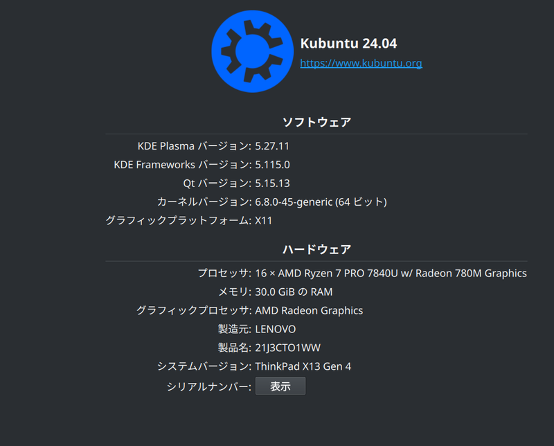

## 購入したもの

　ThinkPad X13 Gen 4 AMD を購入した。

 

注文から20日程度かかり到着したマシンは、ファンの初期不良があり即入院。当初提案された修理期間の長さやサポートの対応の悪さに不満はあったものの、交渉の結果最速での退院が実現したので良かったと思う。

## Kubuntu のインストールと使用

　仕事で Windows を使っているのに、プライベートでまで使うことないじゃん……ということで Linux を使うことに。PowerShell ぜんぜん分からんから WSL2 のコマンドばかり触ってるしな……

　ということで Windows を消してインストール。いちおう事前に[回復ドライブを作成](https://support.microsoft.com/ja-jp/windows/%E5%9B%9E%E5%BE%A9%E3%83%89%E3%83%A9%E3%82%A4%E3%83%96%E3%82%92%E4%BD%9C%E6%88%90%E3%81%99%E3%82%8B-abb4691b-5324-6d4a-8766-73fab304c246)しておく。Bios の設定（セキュアブートをオフにしたりとか）はいろんなブログを参照されたい。 

　今回 ThinkPad X13 Gen4 AMD を選んだ理由の一つに [Ubuntu Certificated に載っている](https://ubuntu.com/certified/202309-32037)ということがある。（バージョン違いではあるが） Ubuntu の動作に問題がないことが確かめられているので心強い。

よく聞く

- スリープから復帰しない
- 外部機器を認識・使用出来ない
- Bluetooth が使えない

という問題は、いまのところ遭遇していない。

　あまり外に持って出る機会はないのでバッテリー等の使用感についてはまだ良くわからないが、いまのところ十分に実用的だと感じている。
