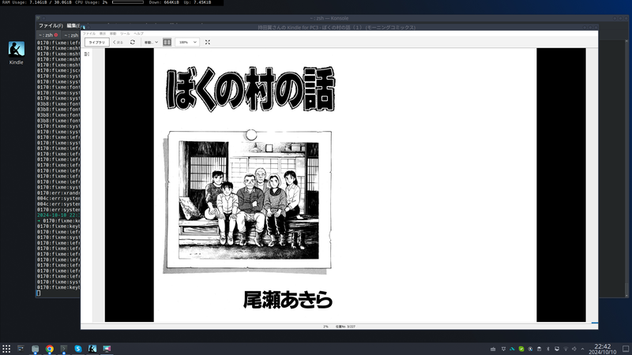
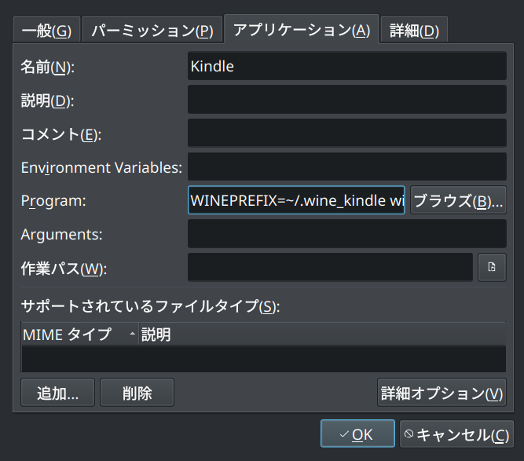
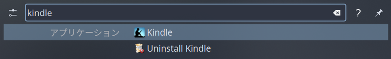

## ポイント

- wine-mono, wine-gecko を別途インストールしておく
- Kindle は 1.4.x  を使う
- いまのところ不具合はない

## WineHQ をインストール

Linux 上で Windows App を動かしたいことがあるよね……

[公式ページ](https://gitlab.winehq.org/wine/wine/-/wikis/Debian-Ubuntu)参照


```shell
sudo dpkg --add-architecture i386
sudo mkdir -pm755 /etc/apt/keyrings
sudo wget -O /etc/apt/keyrings/winehq-archive.key https://dl.winehq.org/wine-builds/winehq.key

```

<br/>

Ubuntu 24.04 のコードネームは Noble Numbat なので noble 用のリポジトリを追加


```shell
sudo wget -NP /etc/apt/sources.list.d/ https://dl.winehq.org/wine-builds/ubuntu/dists/noble/winehq-noble.sources
```

<br/>

といわれるので、 staging ブランチをインストール。


```shell
sudo apt install --install-recommends winehq-staging
```

<br/>

バージョンは 9.19


```shell
wine --version
```

> wine-9.19 (Staging)

<br/>

とりあえず日本語表示用にフォントを入れる。


```shell
sudo apt install winetricks
sudo winetricks --self-update
winetricks -q cjkfonts vcrun2013 

```

<br/>

## wine-mono, wine-gecko をインストール

……で、


```shell
wine notepad.exe
```

<br/>

は上手く行くのだが、いざ Kindle を入れる段階になると wine-gecko がインストールできないだの、 wine-mono が入らないだの言われるので（notepad.exe のときに mono はインストールされてるはずだけど、たぶん試行錯誤してるときにアンインストールされたのだと思う）、 wget で先に入れてしまう。

<br/>


```shell
sudo wget -O - https://dl.winehq.org/wine/wine-mono/9.3.0/wine-mono-9.3.0-x86.tar.xz | sudo tar -xJv -C /opt/wine-staging/share/wine/mono
sudo wget -O /opt/wine-staging/share/wine/gecko/wine-gecko-2.47.4-x86_64.msi https://dl.winehq.org/wine/wine-gecko/2.47.4/wine-gecko-2.47.4-x86_64.msi
sudo wget -O /opt/wine-staging/share/wine/gecko/wine-gecko-2.47.4-x86.msi https://dl.winehq.org/wine/wine-gecko/2.47.4/wine-gecko-2.47.4-x86.msi
```

wine-stable, develop をインストールしていたら wine-stageing の部分を、またそれぞれのヴァージョンが違う場合はそこも置換を。ダウンロードするバージョン・URLは各自調べること。

## Kindle 1.4.x をインストール

公式サイトから落とせるインストーラのバージョン（2.x系）では失敗するのでこ[ちらのサイト](https://kindle-for-pc.en.uptodown.com/windows/versions)から1.40.65535を落としてインストールする。

WINEPREFIX を分けたいので


```shell
WINEPREFIX=~/.wine_kindle wine KindleForPC-installer-1.40.65535.exe
```

<br/>

でインストール・実行される。



<br/>

## ショートカットを追加する

Linux App と同じように使うために。

Kubuntu 用設定で Ubuntu は別だと思うが、適当なディレクトリ上で

<br/>

新規作成 > アプリケーションへのリンク

<br/>



<br/>

Program には

> WINEPREFIX=~/.wine_kindle wine ~/.wine_kindle/drive_c/Program\ Files\ \(x86\)/Amazon/Kindle/Kindle.exe

と入れている。

<br/>

これをタスクバーとかに固定してしまえばクリックで起動するし、適切な名前で Link を作成すれば任意のランチャから起動できるだろう。｜



<br/>

## 使った感触

不具合はないし便利。
